# System Design — Cinema Booking Platform

> Last updated: 2026-03-10

---

## Table of Contents

1. [System Architecture Overview](#1-system-architecture-overview)
2. [Auth Service Flows](#2-auth-service-flows)
3. [Booking & Payment Flows](#3-booking--payment-flows)
4. [Movie Service Flows](#4-movie-service-flows)
   - [4.1 Movie CRUD](#41-movie-crud)
   - [4.2 Showtime CRUD & Seat Availability](#42-showtime-crud--seat-availability)
   - [4.3 Theater CRUD](#43-theater-crud)
   - [4.4 Movie Rating (Upsert)](#44-movie-rating-upsert)
   - [4.5 Movie Comments (CRUD with Soft-Delete)](#45-movie-comments-crud-with-soft-delete)
   - [4.6 Comment Reactions (Like/Dislike Toggle)](#46-comment-reactions-likedislike-toggle)
5. [Infrastructure Flows](#5-infrastructure-flows)
6. [Reference Tables](#6-reference-tables)

---

## 1. System Architecture Overview

### 1.1 C4-Style Component Diagram

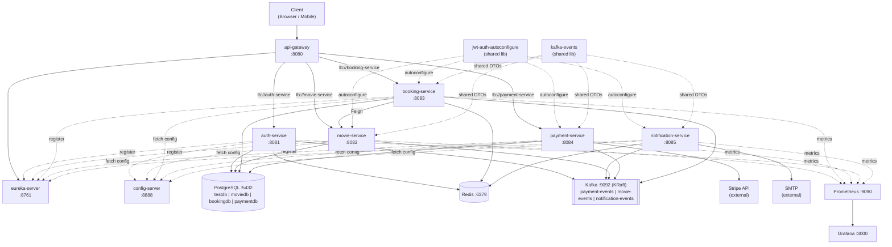
```mermaid
graph TD
    Client["Client\n(Browser / Mobile)"]
    Gateway["api-gateway\n:8080"]
    Eureka["eureka-server\n:8761"]
    Config["config-server\n:8888"]

    AuthSvc["auth-service\n:8081"]
    MovieSvc["movie-service\n:8082"]
    BookingSvc["booking-service\n:8083"]
    PaymentSvc["payment-service\n:8084"]
    NotifSvc["notification-service\n:8085"]

    PG[("PostgreSQL :5432\ntestdb | moviedb | bookingdb | paymentdb")]
    Redis[("Redis :6379")]
    Kafka[["Kafka :9092 (KRaft)\npayment-events | movie-events | notification-events"]]
    Stripe["Stripe API\n(external)"]
    SMTP["SMTP\n(external)"]

    Prometheus["Prometheus :9090"]
    Grafana["Grafana :3000"]

    JwtStarter["jwt-auth-autoconfigure\n(shared lib)"]
    KafkaEvents["kafka-events\n(shared lib)"]

    Client --> Gateway
    Gateway --> Eureka
    Gateway -->|lb://auth-service| AuthSvc
    Gateway -->|lb://movie-service| MovieSvc
    Gateway -->|lb://booking-service| BookingSvc
    Gateway -->|lb://payment-service| PaymentSvc

    AuthSvc --> PG
    AuthSvc --> Redis
    AuthSvc --> Kafka
    MovieSvc --> PG
    BookingSvc --> PG
    BookingSvc --> Redis
    BookingSvc -->|Feign| MovieSvc
    PaymentSvc --> PG
    PaymentSvc --> Stripe
    NotifSvc --> SMTP
    NotifSvc --> Redis
    NotifSvc --> Kafka

    MovieSvc --> Kafka
    PaymentSvc --> Kafka
    BookingSvc --> Kafka

    AuthSvc -.->|register| Eureka
    MovieSvc -.->|register| Eureka
    BookingSvc -.->|register| Eureka
    PaymentSvc -.->|register| Eureka
    NotifSvc -.->|register| Eureka

    AuthSvc -.->|fetch config| Config
    MovieSvc -.->|fetch config| Config
    BookingSvc -.->|fetch config| Config
    PaymentSvc -.->|fetch config| Config
    NotifSvc -.->|fetch config| Config

    MovieSvc -.->|metrics| Prometheus
    BookingSvc -.->|metrics| Prometheus
    PaymentSvc -.->|metrics| Prometheus
    AuthSvc -.->|metrics| Prometheus
    NotifSvc -.->|metrics| Prometheus
    Prometheus --> Grafana

    JwtStarter -.->|autoconfigure| MovieSvc
    JwtStarter -.->|autoconfigure| BookingSvc
    JwtStarter -.->|autoconfigure| PaymentSvc
    JwtStarter -.->|autoconfigure| NotifSvc
    KafkaEvents -.->|shared DTOs| MovieSvc
    KafkaEvents -.->|shared DTOs| BookingSvc
    KafkaEvents -.->|shared DTOs| PaymentSvc
    KafkaEvents -.->|shared DTOs| NotifSvc
```

---

### 1.2 Service Catalog

| Service | Port | Database | Dependencies | Kafka Topics | Key Endpoints |
|---|---|---|---|---|---|
| api-gateway | 8080 | — | Eureka, config-server | — | All routes |
| auth-service | 8081 | testdb (PostgreSQL), Redis | — | Produces: notification-events | /api/auth/**, /api/users/**, /api/auth/validate-token |
| movie-service | 8082 | moviedb (PostgreSQL) | — | Produces: movie-events | /api/movies/**, /api/showtimes/**, /api/theaters/**, /api/comments/** |
| booking-service | 8083 | bookingdb (PostgreSQL), Redis | movie-service (Feign) | Consumes: payment-events | /api/bookings/** |
| payment-service | 8084 | paymentdb (PostgreSQL) | Stripe API | Produces: payment-events | /api/payments/** |
| notification-service | 8085 | Redis (dedup) | SMTP (Gmail) | Consumes: notification-events | — (Kafka consumer only) |
| eureka-server | 8761 | — | — | — | /eureka |
| config-server | 8888 | — | Config repo | — | /actuator |
| PostgreSQL | 5432 | testdb, moviedb, bookingdb | — | — | — |
| Redis | 6379 | — | — | — | — |
| Kafka (KRaft) | 9092 | — | — | payment-events, movie-events, notification-events | — |
| Prometheus | 9090 | — | — | — | /metrics |
| Grafana | 3000 | — | Prometheus | — | Dashboards |

**Gateway Route Table:**

| Path Pattern | Target Service |
|---|---|
| /api/auth/** | lb://auth-service |
| /api/users/** | lb://auth-service |
| /api/movies/** | lb://movie-service |
| /api/showtimes/** | lb://movie-service |
| /api/theaters/** | lb://movie-service |
| /api/comments/** | lb://movie-service |
| /api/bookings/** | lb://booking-service |
| /api/payments/** | lb://payment-service |

---

### 1.3 Infrastructure Layout — Docker Compose Network

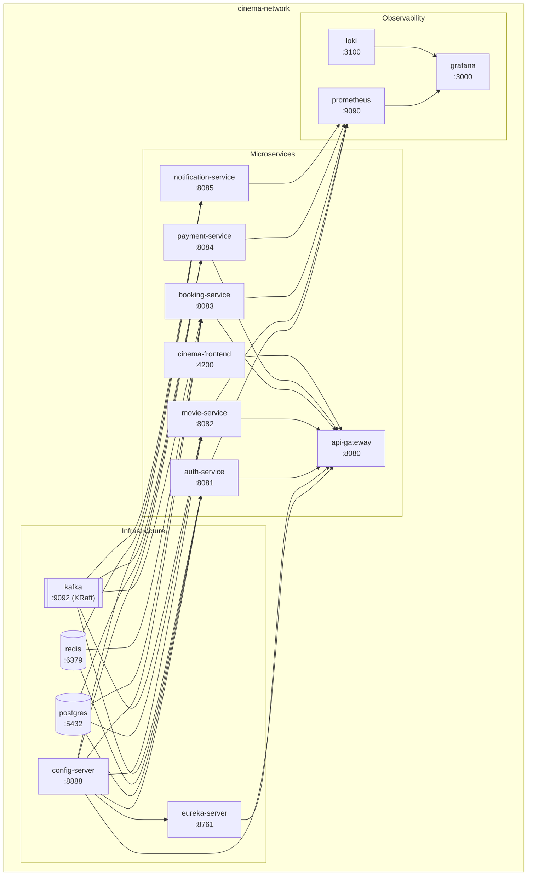
```mermaid
graph LR
    subgraph cinema-network
        direction LR
        subgraph infra["Infrastructure"]
            PG[("postgres\n:5432")]
            Redis[("redis\n:6379")]
            Kafka[["kafka\n:9092 (KRaft)"]]
            Config["config-server\n:8888"]
            Eureka["eureka-server\n:8761"]
        end

        subgraph services["Microservices"]
            Auth["auth-service\n:8081"]
            Movie["movie-service\n:8082"]
            Booking["booking-service\n:8083"]
            Payment["payment-service\n:8084"]
            Notif["notification-service\n:8085"]
            Gateway["api-gateway\n:8080"]
            Frontend["cinema-frontend\n:4200"]
        end

        subgraph observability["Observability"]
            Prometheus["prometheus\n:9090"]
            Grafana["grafana\n:3000"]
            Loki["loki\n:3100"]
        end
    end

    Config --> Eureka
    Config --> Auth
    Config --> Movie
    Config --> Booking
    Config --> Payment
    Config --> Notif
    Config --> Gateway
    Eureka --> Gateway
    PG --> Auth
    PG --> Movie
    PG --> Booking
    PG --> Payment
    Redis --> Auth
    Redis --> Booking
    Redis --> Notif
    Kafka --> Auth
    Kafka --> Movie
    Kafka --> Booking
    Kafka --> Payment
    Kafka --> Notif
    Auth --> Gateway
    Movie --> Gateway
    Booking --> Gateway
    Payment --> Gateway
    Frontend --> Gateway
    Auth --> Prometheus
    Movie --> Prometheus
    Booking --> Prometheus
    Payment --> Prometheus
    Notif --> Prometheus
    Prometheus --> Grafana
    Loki --> Grafana
```

---

### 1.4 Data Flow Overview

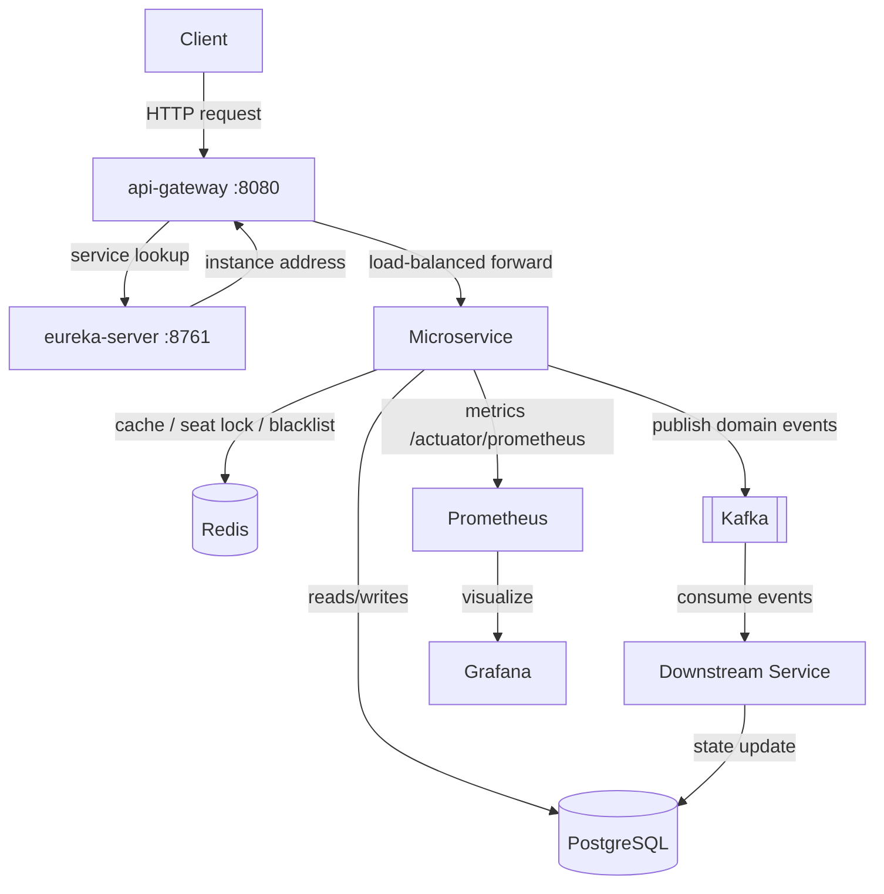
```mermaid
flowchart TD
    C["Client"] -->|HTTP request| GW["api-gateway :8080"]
    GW -->|service lookup| EU["eureka-server :8761"]
    EU -->|instance address| GW
    GW -->|load-balanced forward| SVC["Microservice"]

    SVC -->|reads/writes| DB[("PostgreSQL")]
    SVC -->|cache / seat lock / blacklist| RD[("Redis")]
    SVC -->|publish domain events| KF[["Kafka"]]
    KF -->|consume events| SVC2["Downstream Service"]
    SVC2 -->|state update| DB

    SVC -->|metrics /actuator/prometheus| PR["Prometheus"]
    PR -->|visualize| GR["Grafana"]
```

---

## 2. Auth Service Flows

### 2.1 User Registration

`POST /api/auth/register`

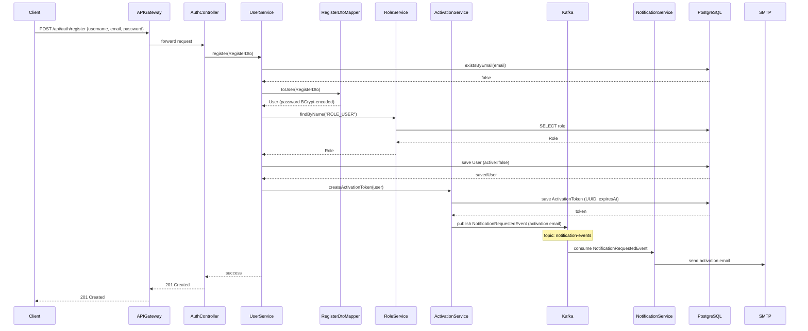
```mermaid
sequenceDiagram
    participant Client
    participant APIGateway
    participant AuthController
    participant UserService
    participant RegisterDtoMapper
    participant RoleService
    participant ActivationService
    participant Kafka
    participant NotificationService
    participant PostgreSQL
    participant SMTP

    Client->>APIGateway: POST /api/auth/register {username, email, password}
    APIGateway->>AuthController: forward request
    AuthController->>UserService: register(RegisterDto)
    UserService->>PostgreSQL: existsByEmail(email)
    PostgreSQL-->>UserService: false

    UserService->>RegisterDtoMapper: toUser(RegisterDto)
    RegisterDtoMapper-->>UserService: User (password BCrypt-encoded)

    UserService->>RoleService: findByName("ROLE_USER")
    RoleService->>PostgreSQL: SELECT role
    PostgreSQL-->>RoleService: Role
    RoleService-->>UserService: Role

    UserService->>PostgreSQL: save User (active=false)
    PostgreSQL-->>UserService: savedUser

    UserService->>ActivationService: createActivationToken(user)
    ActivationService->>PostgreSQL: save ActivationToken (UUID, expiresAt)
    PostgreSQL-->>ActivationService: token

    ActivationService->>Kafka: publish NotificationRequestedEvent (activation email)
    Note over Kafka: topic: notification-events
    Kafka->>NotificationService: consume NotificationRequestedEvent
    NotificationService->>SMTP: send activation email

    UserService-->>AuthController: success
    AuthController-->>APIGateway: 201 Created
    APIGateway-->>Client: 201 Created
```

---

### 2.2 Email Activation

`GET /api/auth/activate?token=uuid`

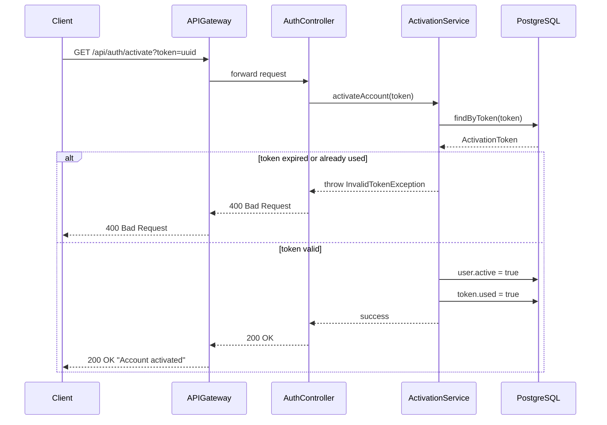
```mermaid
sequenceDiagram
    participant Client
    participant APIGateway
    participant AuthController
    participant ActivationService
    participant PostgreSQL

    Client->>APIGateway: GET /api/auth/activate?token=uuid
    APIGateway->>AuthController: forward request
    AuthController->>ActivationService: activateAccount(token)
    ActivationService->>PostgreSQL: findByToken(token)
    PostgreSQL-->>ActivationService: ActivationToken

    alt token expired or already used
        ActivationService-->>AuthController: throw InvalidTokenException
        AuthController-->>APIGateway: 400 Bad Request
        APIGateway-->>Client: 400 Bad Request
    else token valid
        ActivationService->>PostgreSQL: user.active = true
        ActivationService->>PostgreSQL: token.used = true
        ActivationService-->>AuthController: success
        AuthController-->>APIGateway: 200 OK
        APIGateway-->>Client: 200 OK "Account activated"
    end
```

---

### 2.3 User Login

`POST /api/auth/login`

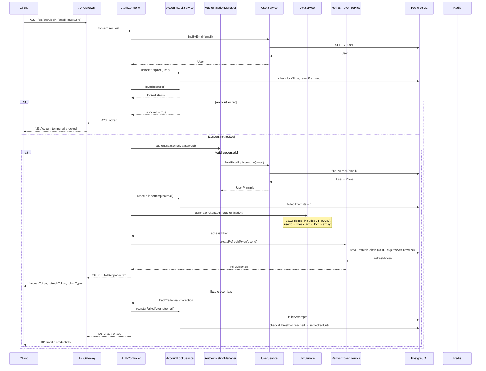
```mermaid
sequenceDiagram
    participant Client
    participant APIGateway
    participant AuthController
    participant AccountLockService
    participant AuthenticationManager
    participant UserService
    participant JwtService
    participant RefreshTokenService
    participant PostgreSQL
    participant Redis

    Client->>APIGateway: POST /api/auth/login {email, password}
    APIGateway->>AuthController: forward request
    AuthController->>UserService: findByEmail(email)
    UserService->>PostgreSQL: SELECT user
    PostgreSQL-->>UserService: User
    UserService-->>AuthController: User

    AuthController->>AccountLockService: unlockIfExpired(user)
    AccountLockService->>PostgreSQL: check lockTime, reset if expired

    AuthController->>AccountLockService: isLocked(user)
    AccountLockService-->>AuthController: locked status

    alt account locked
        AccountLockService-->>AuthController: isLocked = true
        AuthController-->>APIGateway: 423 Locked
        APIGateway-->>Client: 423 Account temporarily locked
    else account not locked
        AuthController->>AuthenticationManager: authenticate(email, password)

        alt valid credentials
            AuthenticationManager->>UserService: loadUserByUsername(email)
            UserService->>PostgreSQL: findByEmail(email)
            PostgreSQL-->>UserService: User + Roles
            UserService-->>AuthenticationManager: UserPrinciple

            AuthController->>AccountLockService: resetFailedAttempts(email)
            AccountLockService->>PostgreSQL: failedAttempts = 0

            AuthController->>JwtService: generateTokenLogin(authentication)
            Note over JwtService: HS512 signed, includes JTI (UUID),<br/>userId + roles claims, 15min expiry
            JwtService-->>AuthController: accessToken

            AuthController->>RefreshTokenService: createRefreshToken(userId)
            RefreshTokenService->>PostgreSQL: save RefreshToken (UUID, expiresAt = now+7d)
            PostgreSQL-->>RefreshTokenService: refreshToken
            RefreshTokenService-->>AuthController: refreshToken

            AuthController-->>APIGateway: 200 OK JwtResponseDto
            APIGateway-->>Client: {accessToken, refreshToken, tokenType}

        else bad credentials
            AuthenticationManager-->>AuthController: BadCredentialsException
            AuthController->>AccountLockService: registerFailedAttempt(email)
            AccountLockService->>PostgreSQL: failedAttempts++
            AccountLockService->>PostgreSQL: check if threshold reached → set lockedUntil
            AuthController-->>APIGateway: 401 Unauthorized
            APIGateway-->>Client: 401 Invalid credentials
        end
    end
```

---

### 2.4 Token Refresh

`POST /api/auth/refresh-token`

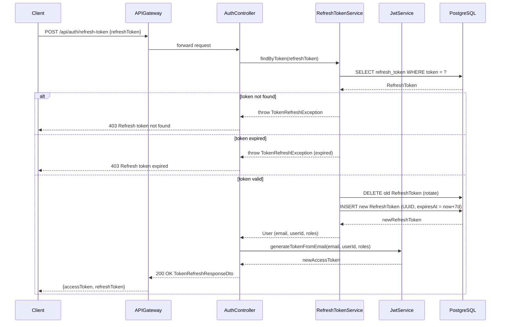
```mermaid
sequenceDiagram
    participant Client
    participant APIGateway
    participant AuthController
    participant RefreshTokenService
    participant JwtService
    participant PostgreSQL

    Client->>APIGateway: POST /api/auth/refresh-token {refreshToken}
    APIGateway->>AuthController: forward request
    AuthController->>RefreshTokenService: findByToken(refreshToken)
    RefreshTokenService->>PostgreSQL: SELECT refresh_token WHERE token = ?
    PostgreSQL-->>RefreshTokenService: RefreshToken

    alt token not found
        RefreshTokenService-->>AuthController: throw TokenRefreshException
        AuthController-->>Client: 403 Refresh token not found
    else token expired
        RefreshTokenService-->>AuthController: throw TokenRefreshException (expired)
        AuthController-->>Client: 403 Refresh token expired
    else token valid
        RefreshTokenService->>PostgreSQL: DELETE old RefreshToken (rotate)
        RefreshTokenService->>PostgreSQL: INSERT new RefreshToken (UUID, expiresAt = now+7d)
        PostgreSQL-->>RefreshTokenService: newRefreshToken

        RefreshTokenService-->>AuthController: User (email, userId, roles)
        AuthController->>JwtService: generateTokenFromEmail(email, userId, roles)
        JwtService-->>AuthController: newAccessToken

        AuthController-->>APIGateway: 200 OK TokenRefreshResponseDto
        APIGateway-->>Client: {accessToken, refreshToken}
    end
```

---

### 2.5 Forgot & Reset Password

`POST /api/auth/forgot-password` + `POST /api/auth/reset-password`

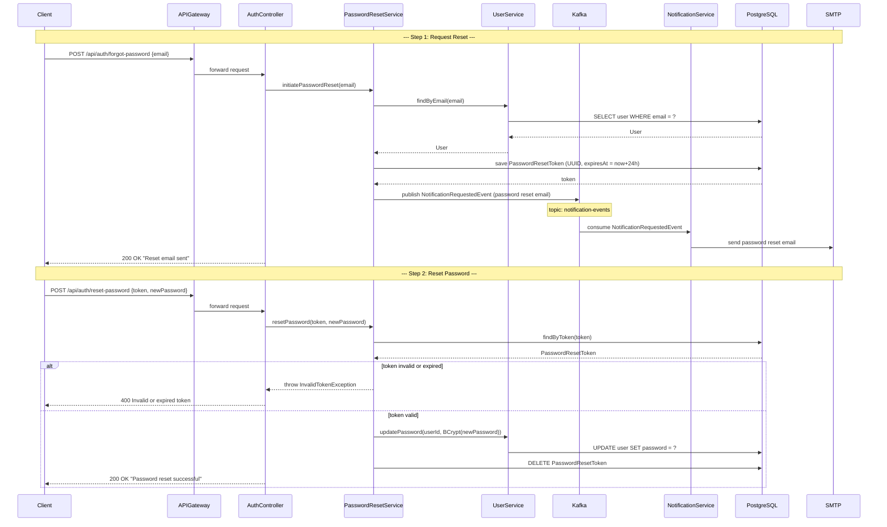
```mermaid
sequenceDiagram
    participant Client
    participant APIGateway
    participant AuthController
    participant PasswordResetService
    participant UserService
    participant Kafka
    participant NotificationService
    participant PostgreSQL
    participant SMTP

    Note over Client,SMTP: --- Step 1: Request Reset ---

    Client->>APIGateway: POST /api/auth/forgot-password {email}
    APIGateway->>AuthController: forward request
    AuthController->>PasswordResetService: initiatePasswordReset(email)
    PasswordResetService->>UserService: findByEmail(email)
    UserService->>PostgreSQL: SELECT user WHERE email = ?
    PostgreSQL-->>UserService: User
    UserService-->>PasswordResetService: User

    PasswordResetService->>PostgreSQL: save PasswordResetToken (UUID, expiresAt = now+24h)
    PostgreSQL-->>PasswordResetService: token

    PasswordResetService->>Kafka: publish NotificationRequestedEvent (password reset email)
    Note over Kafka: topic: notification-events
    Kafka->>NotificationService: consume NotificationRequestedEvent
    NotificationService->>SMTP: send password reset email
    AuthController-->>Client: 200 OK "Reset email sent"

    Note over Client,SMTP: --- Step 2: Reset Password ---

    Client->>APIGateway: POST /api/auth/reset-password {token, newPassword}
    APIGateway->>AuthController: forward request
    AuthController->>PasswordResetService: resetPassword(token, newPassword)
    PasswordResetService->>PostgreSQL: findByToken(token)
    PostgreSQL-->>PasswordResetService: PasswordResetToken

    alt token invalid or expired
        PasswordResetService-->>AuthController: throw InvalidTokenException
        AuthController-->>Client: 400 Invalid or expired token
    else token valid
        PasswordResetService->>UserService: updatePassword(userId, BCrypt(newPassword))
        UserService->>PostgreSQL: UPDATE user SET password = ?
        PasswordResetService->>PostgreSQL: DELETE PasswordResetToken
        AuthController-->>Client: 200 OK "Password reset successful"
    end
```

---

### 2.6 Logout

`POST /api/auth/logout`

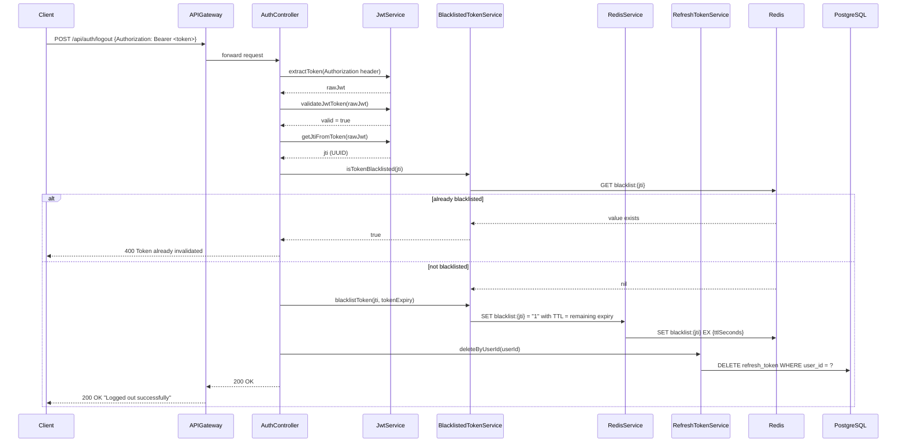
```mermaid
sequenceDiagram
    participant Client
    participant APIGateway
    participant AuthController
    participant JwtService
    participant BlacklistedTokenService
    participant RedisService
    participant RefreshTokenService
    participant Redis
    participant PostgreSQL

    Client->>APIGateway: POST /api/auth/logout {Authorization: Bearer <token>}
    APIGateway->>AuthController: forward request
    AuthController->>JwtService: extractToken(Authorization header)
    JwtService-->>AuthController: rawJwt

    AuthController->>JwtService: validateJwtToken(rawJwt)
    JwtService-->>AuthController: valid = true

    AuthController->>JwtService: getJtiFromToken(rawJwt)
    JwtService-->>AuthController: jti (UUID)

    AuthController->>BlacklistedTokenService: isTokenBlacklisted(jti)
    BlacklistedTokenService->>Redis: GET blacklist:{jti}

    alt already blacklisted
        Redis-->>BlacklistedTokenService: value exists
        BlacklistedTokenService-->>AuthController: true
        AuthController-->>Client: 400 Token already invalidated
    else not blacklisted
        Redis-->>BlacklistedTokenService: nil
        AuthController->>BlacklistedTokenService: blacklistToken(jti, tokenExpiry)
        BlacklistedTokenService->>RedisService: SET blacklist:{jti} = "1" with TTL = remaining expiry
        RedisService->>Redis: SET blacklist:{jti} EX {ttlSeconds}

        AuthController->>RefreshTokenService: deleteByUserId(userId)
        RefreshTokenService->>PostgreSQL: DELETE refresh_token WHERE user_id = ?

        AuthController-->>APIGateway: 200 OK
        APIGateway-->>Client: 200 OK "Logged out successfully"
    end
```

---

### 2.7 Token Validation (Microservice-to-Microservice)

`POST /api/auth/validate-token`

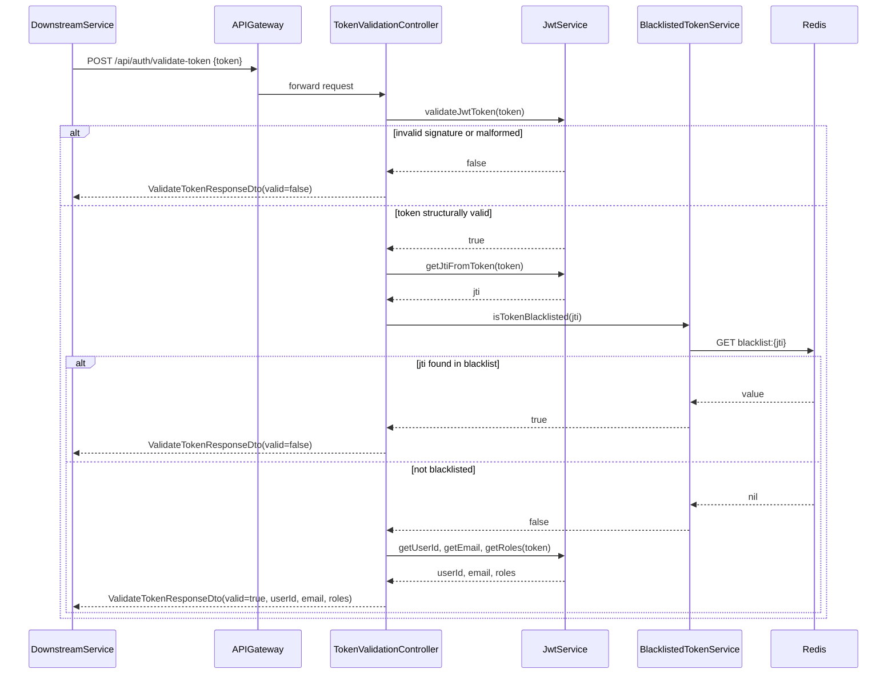
```mermaid
sequenceDiagram
    participant DownstreamService
    participant APIGateway
    participant TokenValidationController
    participant JwtService
    participant BlacklistedTokenService
    participant Redis

    DownstreamService->>APIGateway: POST /api/auth/validate-token {token}
    APIGateway->>TokenValidationController: forward request
    TokenValidationController->>JwtService: validateJwtToken(token)

    alt invalid signature or malformed
        JwtService-->>TokenValidationController: false
        TokenValidationController-->>DownstreamService: ValidateTokenResponseDto(valid=false)
    else token structurally valid
        JwtService-->>TokenValidationController: true
        TokenValidationController->>JwtService: getJtiFromToken(token)
        JwtService-->>TokenValidationController: jti

        TokenValidationController->>BlacklistedTokenService: isTokenBlacklisted(jti)
        BlacklistedTokenService->>Redis: GET blacklist:{jti}

        alt jti found in blacklist
            Redis-->>BlacklistedTokenService: value
            BlacklistedTokenService-->>TokenValidationController: true
            TokenValidationController-->>DownstreamService: ValidateTokenResponseDto(valid=false)
        else not blacklisted
            Redis-->>BlacklistedTokenService: nil
            BlacklistedTokenService-->>TokenValidationController: false
            TokenValidationController->>JwtService: getUserId, getEmail, getRoles(token)
            JwtService-->>TokenValidationController: userId, email, roles
            TokenValidationController-->>DownstreamService: ValidateTokenResponseDto(valid=true, userId, email, roles)
        end
    end
```

---

## 3. Booking & Payment Flows

### 3.1 Seat Reservation

`POST /api/bookings/reserve`

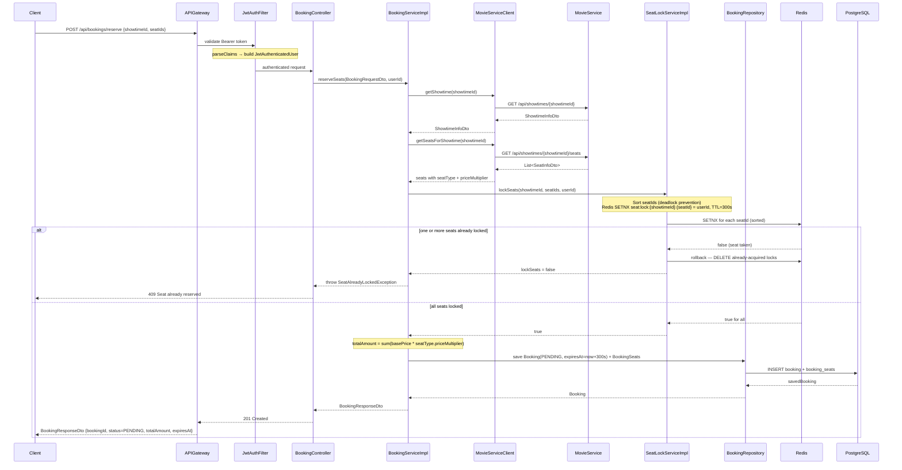
```mermaid
sequenceDiagram
    participant Client
    participant APIGateway
    participant JwtAuthFilter
    participant BookingController
    participant BookingServiceImpl
    participant MovieServiceClient
    participant MovieService
    participant SeatLockServiceImpl
    participant BookingRepository
    participant Redis
    participant PostgreSQL

    Client->>APIGateway: POST /api/bookings/reserve {showtimeId, seatIds}
    APIGateway->>JwtAuthFilter: validate Bearer token
    Note over JwtAuthFilter: parseClaims → build JwtAuthenticatedUser
    JwtAuthFilter->>BookingController: authenticated request

    BookingController->>BookingServiceImpl: reserveSeats(BookingRequestDto, userId)

    BookingServiceImpl->>MovieServiceClient: getShowtime(showtimeId)
    MovieServiceClient->>MovieService: GET /api/showtimes/{showtimeId}
    MovieService-->>MovieServiceClient: ShowtimeInfoDto
    MovieServiceClient-->>BookingServiceImpl: ShowtimeInfoDto

    BookingServiceImpl->>MovieServiceClient: getSeatsForShowtime(showtimeId)
    MovieServiceClient->>MovieService: GET /api/showtimes/{showtimeId}/seats
    MovieService-->>MovieServiceClient: List<SeatInfoDto>
    MovieServiceClient-->>BookingServiceImpl: seats with seatType + priceMultiplier

    BookingServiceImpl->>SeatLockServiceImpl: lockSeats(showtimeId, seatIds, userId)
    Note over SeatLockServiceImpl: Sort seatIds (deadlock prevention)<br/>Redis SETNX seat:lock:{showtimeId}:{seatId} = userId, TTL=300s
    SeatLockServiceImpl->>Redis: SETNX for each seatId (sorted)

    alt one or more seats already locked
        Redis-->>SeatLockServiceImpl: false (seat taken)
        SeatLockServiceImpl->>Redis: rollback — DELETE already-acquired locks
        SeatLockServiceImpl-->>BookingServiceImpl: lockSeats = false
        BookingServiceImpl-->>BookingController: throw SeatAlreadyLockedException
        BookingController-->>Client: 409 Seat already reserved
    else all seats locked
        Redis-->>SeatLockServiceImpl: true for all
        SeatLockServiceImpl-->>BookingServiceImpl: true

        Note over BookingServiceImpl: totalAmount = sum(basePrice * seatType.priceMultiplier)
        BookingServiceImpl->>BookingRepository: save Booking(PENDING, expiresAt=now+300s) + BookingSeats
        BookingRepository->>PostgreSQL: INSERT booking + booking_seats
        PostgreSQL-->>BookingRepository: savedBooking
        BookingRepository-->>BookingServiceImpl: Booking

        BookingServiceImpl-->>BookingController: BookingResponseDto
        BookingController-->>APIGateway: 201 Created
        APIGateway-->>Client: BookingResponseDto {bookingId, status=PENDING, totalAmount, expiresAt}
    end
```

---

### 3.2 Payment Intent Creation

`POST /api/payments/create-intent`

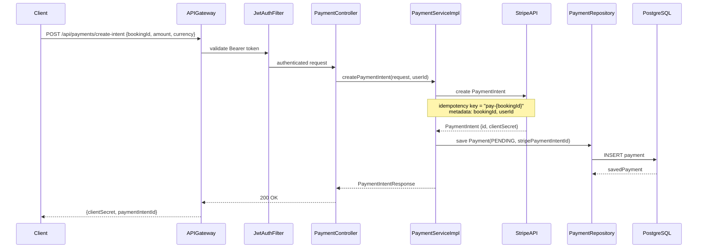
```mermaid
sequenceDiagram
    participant Client
    participant APIGateway
    participant JwtAuthFilter
    participant PaymentController
    participant PaymentServiceImpl
    participant StripeAPI
    participant PaymentRepository
    participant PostgreSQL

    Client->>APIGateway: POST /api/payments/create-intent {bookingId, amount, currency}
    APIGateway->>JwtAuthFilter: validate Bearer token
    JwtAuthFilter->>PaymentController: authenticated request

    PaymentController->>PaymentServiceImpl: createPaymentIntent(request, userId)

    PaymentServiceImpl->>StripeAPI: create PaymentIntent
    Note over PaymentServiceImpl,StripeAPI: idempotency key = "pay-{bookingId}"<br/>metadata: bookingId, userId
    StripeAPI-->>PaymentServiceImpl: PaymentIntent {id, clientSecret}

    PaymentServiceImpl->>PaymentRepository: save Payment(PENDING, stripePaymentIntentId)
    PaymentRepository->>PostgreSQL: INSERT payment
    PostgreSQL-->>PaymentRepository: savedPayment

    PaymentServiceImpl-->>PaymentController: PaymentIntentResponse
    PaymentController-->>APIGateway: 200 OK
    APIGateway-->>Client: {clientSecret, paymentIntentId}
```

---

### 3.3 Stripe Webhook → Kafka → Booking Confirmation

End-to-end payment confirmation via Stripe webhook.

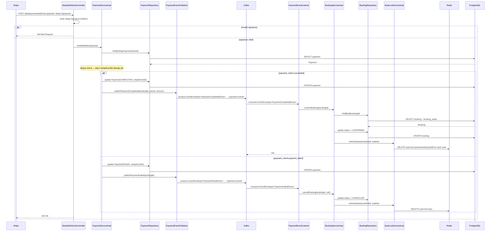
```mermaid
sequenceDiagram
    participant Stripe
    participant StripeWebhookController
    participant PaymentServiceImpl
    participant PaymentRepository
    participant PaymentEventPublisher
    participant Kafka
    participant PaymentEventListener
    participant BookingServiceImpl
    participant BookingRepository
    participant SeatLockServiceImpl
    participant Redis
    participant PostgreSQL

    Stripe->>StripeWebhookController: POST /api/payments/webhook {payload, Stripe-Signature}
    StripeWebhookController->>StripeWebhookController: verify Stripe-Signature (HMAC)

    alt invalid signature
        StripeWebhookController-->>Stripe: 400 Bad Request
    else signature valid
        StripeWebhookController->>PaymentServiceImpl: handleWebhook(event)
        PaymentServiceImpl->>PaymentRepository: findByStripePaymentIntentId
        PaymentRepository->>PostgreSQL: SELECT payment
        PostgreSQL-->>PaymentRepository: Payment

        Note over PaymentServiceImpl: dedup check — skip if stripeEventId already set

        alt payment_intent.succeeded
            PaymentServiceImpl->>PaymentRepository: update Payment(COMPLETED, stripeEventId)
            PaymentRepository->>PostgreSQL: UPDATE payment
            PaymentServiceImpl->>PaymentEventPublisher: publishPaymentCompleted(bookingId, userId, amount)
            PaymentEventPublisher->>Kafka: produce EventEnvelope<PaymentCompletedEvent> → "payment-events"

            Kafka->>PaymentEventListener: consume EventEnvelope<PaymentCompletedEvent>
            PaymentEventListener->>BookingServiceImpl: confirmBooking(bookingId)
            BookingServiceImpl->>BookingRepository: findById(bookingId)
            BookingRepository->>PostgreSQL: SELECT booking + booking_seats
            PostgreSQL-->>BookingRepository: Booking
            BookingServiceImpl->>BookingRepository: update status = CONFIRMED
            BookingRepository->>PostgreSQL: UPDATE booking
            BookingServiceImpl->>SeatLockServiceImpl: unlockSeats(showtimeId, seatIds)
            SeatLockServiceImpl->>Redis: DELETE seat:lock:{showtimeId}:{seatId} for each seat

            PaymentEventListener-->>Kafka: ack

        else payment_intent.payment_failed
            PaymentServiceImpl->>PaymentRepository: update Payment(FAILED, stripeEventId)
            PaymentRepository->>PostgreSQL: UPDATE payment
            PaymentServiceImpl->>PaymentEventPublisher: publishPaymentFailed(bookingId)
            PaymentEventPublisher->>Kafka: produce EventEnvelope<PaymentFailedEvent> → "payment-events"

            Kafka->>PaymentEventListener: consume EventEnvelope<PaymentFailedEvent>
            PaymentEventListener->>BookingServiceImpl: cancelBooking(bookingId, null)
            BookingServiceImpl->>BookingRepository: update status = CANCELLED
            BookingServiceImpl->>SeatLockServiceImpl: unlockSeats(showtimeId, seatIds)
            SeatLockServiceImpl->>Redis: DELETE seat lock keys
        end

        StripeWebhookController-->>Stripe: 200 OK
    end
```

---

### 3.4 Fake Payment → Kafka → Booking Confirmation

`POST /api/payments/fake-success`

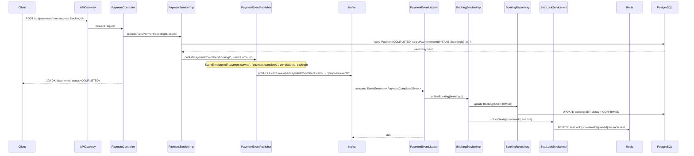
```mermaid
sequenceDiagram
    participant Client
    participant APIGateway
    participant PaymentController
    participant PaymentServiceImpl
    participant PaymentEventPublisher
    participant Kafka
    participant PaymentEventListener
    participant BookingServiceImpl
    participant BookingRepository
    participant SeatLockServiceImpl
    participant Redis
    participant PostgreSQL

    Client->>APIGateway: POST /api/payments/fake-success {bookingId}
    APIGateway->>PaymentController: forward request
    PaymentController->>PaymentServiceImpl: processFakePayment(bookingId, userId)

    PaymentServiceImpl->>PostgreSQL: save Payment(COMPLETED, stripePaymentIntentId="FAKE-{bookingId}-{ts}")
    PostgreSQL-->>PaymentServiceImpl: savedPayment

    PaymentServiceImpl->>PaymentEventPublisher: publishPaymentCompleted(bookingId, userId, amount)
    Note over PaymentEventPublisher: EventEnvelope.of("payment-service", "payment.completed", correlationId, payload)
    PaymentEventPublisher->>Kafka: produce EventEnvelope<PaymentCompletedEvent> → "payment-events"

    PaymentController-->>Client: 200 OK {paymentId, status=COMPLETED}

    Kafka->>PaymentEventListener: consume EventEnvelope<PaymentCompletedEvent>
    PaymentEventListener->>BookingServiceImpl: confirmBooking(bookingId)
    BookingServiceImpl->>BookingRepository: update Booking(CONFIRMED)
    BookingRepository->>PostgreSQL: UPDATE booking SET status = CONFIRMED
    BookingServiceImpl->>SeatLockServiceImpl: unlockSeats(showtimeId, seatIds)
    SeatLockServiceImpl->>Redis: DELETE seat:lock:{showtimeId}:{seatId} for each seat
    PaymentEventListener-->>Kafka: ack
```

---

### 3.5 Booking Expiry Scheduler

Periodic cleanup of abandoned PENDING bookings.

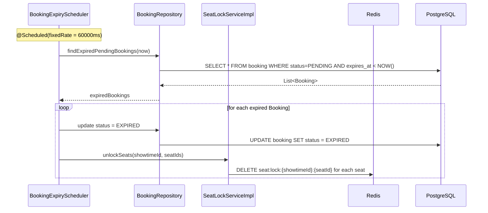
```mermaid
sequenceDiagram
    participant BookingExpiryScheduler
    participant BookingRepository
    participant SeatLockServiceImpl
    participant Redis
    participant PostgreSQL

    Note over BookingExpiryScheduler: @Scheduled(fixedRate = 60000ms)

    BookingExpiryScheduler->>BookingRepository: findExpiredPendingBookings(now)
    BookingRepository->>PostgreSQL: SELECT * FROM booking WHERE status=PENDING AND expires_at < NOW()
    PostgreSQL-->>BookingRepository: List<Booking>
    BookingRepository-->>BookingExpiryScheduler: expiredBookings

    loop for each expired Booking
        BookingExpiryScheduler->>BookingRepository: update status = EXPIRED
        BookingRepository->>PostgreSQL: UPDATE booking SET status = EXPIRED

        BookingExpiryScheduler->>SeatLockServiceImpl: unlockSeats(showtimeId, seatIds)
        SeatLockServiceImpl->>Redis: DELETE seat:lock:{showtimeId}:{seatId} for each seat
    end
```

---

## 4. Movie Service Flows

### 4.1 Movie CRUD

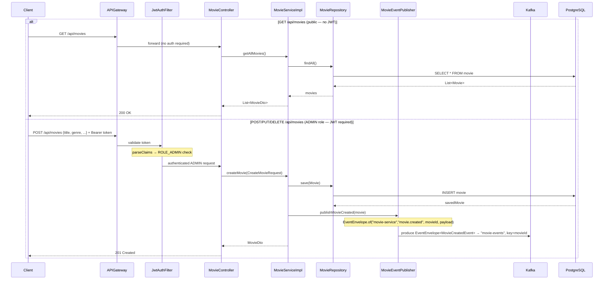
```mermaid
sequenceDiagram
    participant Client
    participant APIGateway
    participant JwtAuthFilter
    participant MovieController
    participant MovieServiceImpl
    participant MovieRepository
    participant MovieEventPublisher
    participant Kafka
    participant PostgreSQL

    alt GET /api/movies (public — no JWT)
        Client->>APIGateway: GET /api/movies
        APIGateway->>MovieController: forward (no auth required)
        MovieController->>MovieServiceImpl: getAllMovies()
        MovieServiceImpl->>MovieRepository: findAll()
        MovieRepository->>PostgreSQL: SELECT * FROM movie
        PostgreSQL-->>MovieRepository: List<Movie>
        MovieRepository-->>MovieServiceImpl: movies
        MovieServiceImpl-->>MovieController: List<MovieDto>
        MovieController-->>Client: 200 OK

    else POST/PUT/DELETE /api/movies (ADMIN role — JWT required)
        Client->>APIGateway: POST /api/movies {title, genre, ...} + Bearer token
        APIGateway->>JwtAuthFilter: validate token
        Note over JwtAuthFilter: parseClaims → ROLE_ADMIN check
        JwtAuthFilter->>MovieController: authenticated ADMIN request

        MovieController->>MovieServiceImpl: createMovie(CreateMovieRequest)
        MovieServiceImpl->>MovieRepository: save(Movie)
        MovieRepository->>PostgreSQL: INSERT movie
        PostgreSQL-->>MovieRepository: savedMovie

        MovieServiceImpl->>MovieEventPublisher: publishMovieCreated(movie)
        Note over MovieEventPublisher: EventEnvelope.of("movie-service","movie.created", movieId, payload)
        MovieEventPublisher->>Kafka: produce EventEnvelope<MovieCreatedEvent> → "movie-events", key=movieId

        MovieServiceImpl-->>MovieController: MovieDto
        MovieController-->>Client: 201 Created
    end
```

---

### 4.2 Showtime CRUD & Seat Availability

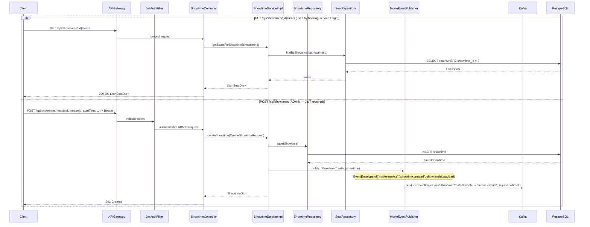
```mermaid
sequenceDiagram
    participant Client
    participant APIGateway
    participant JwtAuthFilter
    participant ShowtimeController
    participant ShowtimeServiceImpl
    participant ShowtimeRepository
    participant SeatRepository
    participant MovieEventPublisher
    participant Kafka
    participant PostgreSQL

    alt GET /api/showtimes/{id}/seats (used by booking-service Feign)
        Client->>APIGateway: GET /api/showtimes/{id}/seats
        APIGateway->>ShowtimeController: forward request
        ShowtimeController->>ShowtimeServiceImpl: getSeatsForShowtime(showtimeId)
        ShowtimeServiceImpl->>SeatRepository: findByShowtimeId(showtimeId)
        SeatRepository->>PostgreSQL: SELECT seat WHERE showtime_id = ?
        PostgreSQL-->>SeatRepository: List<Seat>
        SeatRepository-->>ShowtimeServiceImpl: seats
        ShowtimeServiceImpl-->>ShowtimeController: List<SeatDto>
        ShowtimeController-->>Client: 200 OK List<SeatDto>

    else POST /api/showtimes (ADMIN — JWT required)
        Client->>APIGateway: POST /api/showtimes {movieId, theaterId, startTime, ...} + Bearer
        APIGateway->>JwtAuthFilter: validate token
        JwtAuthFilter->>ShowtimeController: authenticated ADMIN request

        ShowtimeController->>ShowtimeServiceImpl: createShowtime(CreateShowtimeRequest)
        ShowtimeServiceImpl->>ShowtimeRepository: save(Showtime)
        ShowtimeRepository->>PostgreSQL: INSERT showtime
        PostgreSQL-->>ShowtimeRepository: savedShowtime

        ShowtimeServiceImpl->>MovieEventPublisher: publishShowtimeCreated(showtime)
        Note over MovieEventPublisher: EventEnvelope.of("movie-service","showtime.created", showtimeId, payload)
        MovieEventPublisher->>Kafka: produce EventEnvelope<ShowtimeCreatedEvent> → "movie-events", key=showtimeId

        ShowtimeServiceImpl-->>ShowtimeController: ShowtimeDto
        ShowtimeController-->>Client: 201 Created
    end
```

---

### 4.3 Theater CRUD

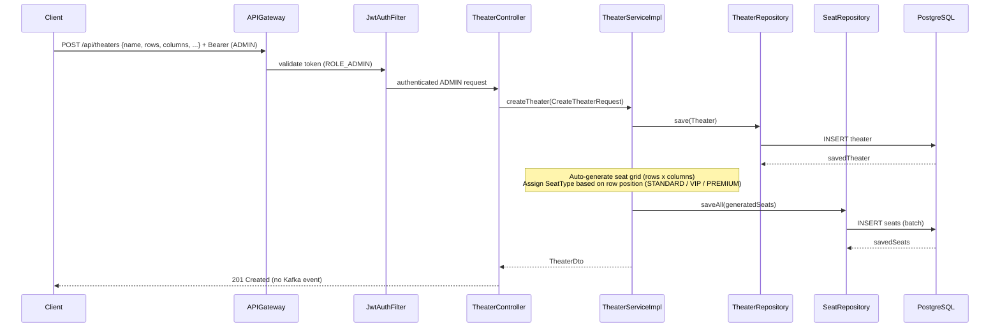
```mermaid
sequenceDiagram
    participant Client
    participant APIGateway
    participant JwtAuthFilter
    participant TheaterController
    participant TheaterServiceImpl
    participant TheaterRepository
    participant SeatRepository
    participant PostgreSQL

    Client->>APIGateway: POST /api/theaters {name, rows, columns, ...} + Bearer (ADMIN)
    APIGateway->>JwtAuthFilter: validate token (ROLE_ADMIN)
    JwtAuthFilter->>TheaterController: authenticated ADMIN request

    TheaterController->>TheaterServiceImpl: createTheater(CreateTheaterRequest)
    TheaterServiceImpl->>TheaterRepository: save(Theater)
    TheaterRepository->>PostgreSQL: INSERT theater
    PostgreSQL-->>TheaterRepository: savedTheater

    Note over TheaterServiceImpl: Auto-generate seat grid (rows x columns)<br/>Assign SeatType based on row position (STANDARD / VIP / PREMIUM)
    TheaterServiceImpl->>SeatRepository: saveAll(generatedSeats)
    SeatRepository->>PostgreSQL: INSERT seats (batch)
    PostgreSQL-->>SeatRepository: savedSeats

    TheaterServiceImpl-->>TheaterController: TheaterDto
    TheaterController-->>Client: 201 Created (no Kafka event)
```

---

### 4.4 Movie Rating (Upsert)

`POST /api/movies/{movieId}/ratings` | `GET /api/movies/{movieId}/ratings`

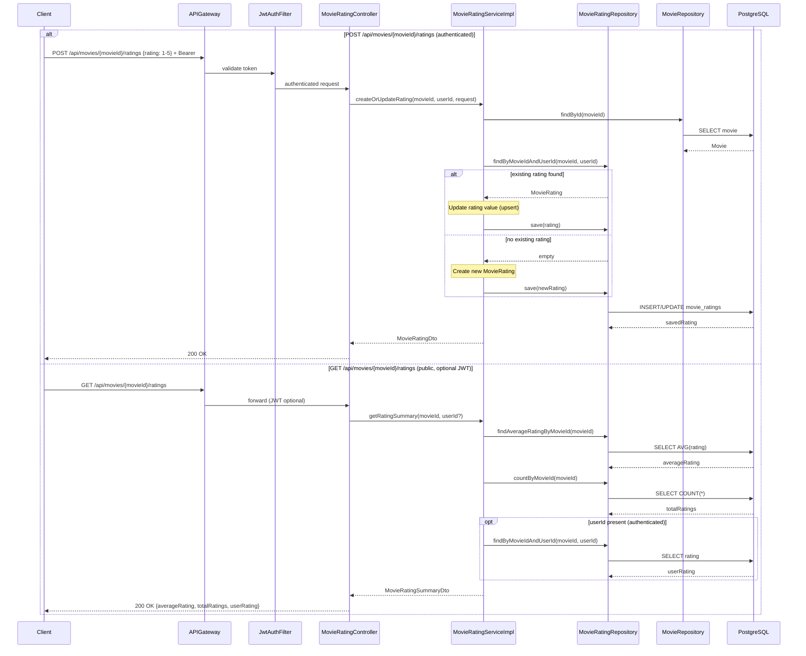
```mermaid
sequenceDiagram
    participant Client
    participant APIGateway
    participant JwtAuthFilter
    participant MovieRatingController
    participant MovieRatingServiceImpl
    participant MovieRatingRepository
    participant MovieRepository
    participant PostgreSQL

    alt POST /api/movies/{movieId}/ratings (authenticated)
        Client->>APIGateway: POST /api/movies/{movieId}/ratings {rating: 1-5} + Bearer
        APIGateway->>JwtAuthFilter: validate token
        JwtAuthFilter->>MovieRatingController: authenticated request
        MovieRatingController->>MovieRatingServiceImpl: createOrUpdateRating(movieId, userId, request)
        MovieRatingServiceImpl->>MovieRepository: findById(movieId)
        MovieRepository->>PostgreSQL: SELECT movie
        PostgreSQL-->>MovieRepository: Movie
        MovieRatingServiceImpl->>MovieRatingRepository: findByMovieIdAndUserId(movieId, userId)

        alt existing rating found
            MovieRatingRepository-->>MovieRatingServiceImpl: MovieRating
            Note over MovieRatingServiceImpl: Update rating value (upsert)
            MovieRatingServiceImpl->>MovieRatingRepository: save(rating)
        else no existing rating
            MovieRatingRepository-->>MovieRatingServiceImpl: empty
            Note over MovieRatingServiceImpl: Create new MovieRating
            MovieRatingServiceImpl->>MovieRatingRepository: save(newRating)
        end

        MovieRatingRepository->>PostgreSQL: INSERT/UPDATE movie_ratings
        PostgreSQL-->>MovieRatingRepository: savedRating
        MovieRatingServiceImpl-->>MovieRatingController: MovieRatingDto
        MovieRatingController-->>Client: 200 OK

    else GET /api/movies/{movieId}/ratings (public, optional JWT)
        Client->>APIGateway: GET /api/movies/{movieId}/ratings
        APIGateway->>MovieRatingController: forward (JWT optional)
        MovieRatingController->>MovieRatingServiceImpl: getRatingSummary(movieId, userId?)
        MovieRatingServiceImpl->>MovieRatingRepository: findAverageRatingByMovieId(movieId)
        MovieRatingRepository->>PostgreSQL: SELECT AVG(rating)
        PostgreSQL-->>MovieRatingRepository: averageRating
        MovieRatingServiceImpl->>MovieRatingRepository: countByMovieId(movieId)
        MovieRatingRepository->>PostgreSQL: SELECT COUNT(*)
        PostgreSQL-->>MovieRatingRepository: totalRatings

        opt userId present (authenticated)
            MovieRatingServiceImpl->>MovieRatingRepository: findByMovieIdAndUserId(movieId, userId)
            MovieRatingRepository->>PostgreSQL: SELECT rating
            PostgreSQL-->>MovieRatingRepository: userRating
        end

        MovieRatingServiceImpl-->>MovieRatingController: MovieRatingSummaryDto
        MovieRatingController-->>Client: 200 OK {averageRating, totalRatings, userRating}
    end
```

---

### 4.5 Movie Comments (CRUD with Soft-Delete)

`POST/GET /api/movies/{movieId}/comments` | `PUT/DELETE /api/comments/{commentId}`

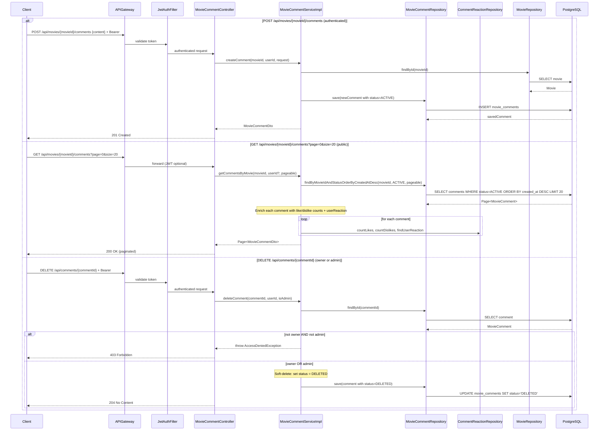
```mermaid
sequenceDiagram
    participant Client
    participant APIGateway
    participant JwtAuthFilter
    participant MovieCommentController
    participant MovieCommentServiceImpl
    participant MovieCommentRepository
    participant CommentReactionRepository
    participant MovieRepository
    participant PostgreSQL

    alt POST /api/movies/{movieId}/comments (authenticated)
        Client->>APIGateway: POST /api/movies/{movieId}/comments {content} + Bearer
        APIGateway->>JwtAuthFilter: validate token
        JwtAuthFilter->>MovieCommentController: authenticated request
        MovieCommentController->>MovieCommentServiceImpl: createComment(movieId, userId, request)
        MovieCommentServiceImpl->>MovieRepository: findById(movieId)
        MovieRepository->>PostgreSQL: SELECT movie
        PostgreSQL-->>MovieRepository: Movie
        MovieCommentServiceImpl->>MovieCommentRepository: save(newComment with status=ACTIVE)
        MovieCommentRepository->>PostgreSQL: INSERT movie_comments
        PostgreSQL-->>MovieCommentRepository: savedComment
        MovieCommentServiceImpl-->>MovieCommentController: MovieCommentDto
        MovieCommentController-->>Client: 201 Created

    else GET /api/movies/{movieId}/comments?page=0&size=20 (public)
        Client->>APIGateway: GET /api/movies/{movieId}/comments?page=0&size=20
        APIGateway->>MovieCommentController: forward (JWT optional)
        MovieCommentController->>MovieCommentServiceImpl: getCommentsByMovie(movieId, userId?, pageable)
        MovieCommentServiceImpl->>MovieCommentRepository: findByMovieIdAndStatusOrderByCreatedAtDesc(movieId, ACTIVE, pageable)
        MovieCommentRepository->>PostgreSQL: SELECT comments WHERE status=ACTIVE ORDER BY created_at DESC LIMIT 20
        PostgreSQL-->>MovieCommentRepository: Page<MovieComment>
        Note over MovieCommentServiceImpl: Enrich each comment with like/dislike counts + userReaction
        loop for each comment
            MovieCommentServiceImpl->>CommentReactionRepository: countLikes, countDislikes, findUserReaction
        end
        MovieCommentServiceImpl-->>MovieCommentController: Page<MovieCommentDto>
        MovieCommentController-->>Client: 200 OK (paginated)

    else DELETE /api/comments/{commentId} (owner or admin)
        Client->>APIGateway: DELETE /api/comments/{commentId} + Bearer
        APIGateway->>JwtAuthFilter: validate token
        JwtAuthFilter->>MovieCommentController: authenticated request
        MovieCommentController->>MovieCommentServiceImpl: deleteComment(commentId, userId, isAdmin)
        MovieCommentServiceImpl->>MovieCommentRepository: findById(commentId)
        MovieCommentRepository->>PostgreSQL: SELECT comment
        PostgreSQL-->>MovieCommentRepository: MovieComment

        alt not owner AND not admin
            MovieCommentServiceImpl-->>MovieCommentController: throw AccessDeniedException
            MovieCommentController-->>Client: 403 Forbidden
        else owner OR admin
            Note over MovieCommentServiceImpl: Soft-delete: set status = DELETED
            MovieCommentServiceImpl->>MovieCommentRepository: save(comment with status=DELETED)
            MovieCommentRepository->>PostgreSQL: UPDATE movie_comments SET status='DELETED'
            MovieCommentController-->>Client: 204 No Content
        end
    end
```

---

### 4.6 Comment Reactions (Like/Dislike Toggle)

`POST/DELETE /api/comments/{commentId}/reactions`

```mermaid
sequenceDiagram
    participant Client
    participant APIGateway
    participant JwtAuthFilter
    participant CommentReactionController
    participant CommentReactionServiceImpl
    participant CommentReactionRepository
    participant MovieCommentRepository
    participant PostgreSQL

    Client->>APIGateway: POST /api/comments/{commentId}/reactions {isLike: true} + Bearer
    APIGateway->>JwtAuthFilter: validate token
    JwtAuthFilter->>CommentReactionController: authenticated request
    CommentReactionController->>CommentReactionServiceImpl: toggleReaction(commentId, userId, request)

    CommentReactionServiceImpl->>MovieCommentRepository: findById(commentId)
    MovieCommentRepository->>PostgreSQL: SELECT comment WHERE status=ACTIVE
    PostgreSQL-->>MovieCommentRepository: MovieComment

    CommentReactionServiceImpl->>CommentReactionRepository: findByCommentIdAndUserId(commentId, userId)
    CommentReactionRepository->>PostgreSQL: SELECT reaction
    PostgreSQL-->>CommentReactionRepository: Optional<CommentReaction>

    alt no existing reaction
        Note over CommentReactionServiceImpl: Create new reaction
        CommentReactionServiceImpl->>CommentReactionRepository: save(new CommentReaction)
        CommentReactionRepository->>PostgreSQL: INSERT comment_reactions
    else same type clicked (toggle off)
        Note over CommentReactionServiceImpl: Remove reaction (hard delete)
        CommentReactionServiceImpl->>CommentReactionRepository: delete(existing)
        CommentReactionRepository->>PostgreSQL: DELETE FROM comment_reactions
    else different type (switch)
        Note over CommentReactionServiceImpl: Switch like↔dislike
        CommentReactionServiceImpl->>CommentReactionRepository: save(updated reaction)
        CommentReactionRepository->>PostgreSQL: UPDATE comment_reactions SET is_like=?
    end

    CommentReactionServiceImpl->>CommentReactionRepository: countLikes, countDislikes
    CommentReactionRepository->>PostgreSQL: SELECT COUNT(*)
    PostgreSQL-->>CommentReactionRepository: likeCount, dislikeCount
    CommentReactionServiceImpl-->>CommentReactionController: CommentReactionDto
    CommentReactionController-->>Client: 200 OK {commentId, likeCount, dislikeCount, userReaction}
```

---

## 5. Infrastructure Flows

### 5.1 API Gateway Routing

```mermaid
sequenceDiagram
    participant Client
    participant APIGateway
    participant Eureka
    participant auth-service
    participant movie-service
    participant booking-service
    participant payment-service

    Client->>APIGateway: HTTP request with path

    alt /api/auth/** or /api/users/**
        APIGateway->>Eureka: lookup lb://auth-service
        Eureka-->>APIGateway: instance address
        APIGateway->>auth-service: forward request
        auth-service-->>APIGateway: response
    else /api/movies/** or /api/showtimes/** or /api/theaters/** or /api/comments/**
        APIGateway->>Eureka: lookup lb://movie-service
        Eureka-->>APIGateway: instance address
        APIGateway->>movie-service: forward request
        movie-service-->>APIGateway: response
    else /api/bookings/**
        APIGateway->>Eureka: lookup lb://booking-service
        Eureka-->>APIGateway: instance address
        APIGateway->>booking-service: forward request
        booking-service-->>APIGateway: response
    else /api/payments/**
        APIGateway->>Eureka: lookup lb://payment-service
        Eureka-->>APIGateway: instance address
        APIGateway->>payment-service: forward request
        payment-service-->>APIGateway: response
    end

    APIGateway-->>Client: HTTP response
```

---

### 5.2 Service Discovery & Registration

```mermaid
sequenceDiagram
    participant Services
    participant EurekaServer

    Note over Services,EurekaServer: Startup Phase
    Services->>EurekaServer: POST /eureka/apps/{appName} (register)
    Note over Services: sends: hostname, port, healthCheckUrl, status=UP
    EurekaServer-->>Services: 204 No Content (registered)

    Note over Services,EurekaServer: Heartbeat Phase (every 30s)
    loop every 30 seconds
        Services->>EurekaServer: PUT /eureka/apps/{appName}/{instanceId} (heartbeat)
        EurekaServer-->>Services: 200 OK
    end

    Note over Services,EurekaServer: Gateway Discovery
    Services->>EurekaServer: GET /eureka/apps (fetch registry)
    EurekaServer-->>Services: all registered instances

    Note over Services: api-gateway resolves lb://service-name<br/>→ load-balanced instance from registry
```

---

### 5.3 Config Server Bootstrap

```mermaid
sequenceDiagram
    participant ConfigServer
    participant ConfigRepo
    participant Services

    Note over ConfigServer,Services: Application Startup

    Services->>ConfigServer: GET /config/{service-name}/{profile}
    Note over Services: bootstrap.yml points to config-server URL
    ConfigServer->>ConfigRepo: read config files
    ConfigRepo-->>ConfigServer: YAML / properties
    ConfigServer-->>Services: merged configuration

    Note over Services: Shared JWT secret distributed via config-server.<br/>All services use same HS512 signing key.

    Services->>Services: apply config (DB URL, Kafka brokers, JWT secret, etc.)
    Services->>Services: complete Spring context initialization
```

---

### 5.4 Kafka DLT Error Handling

```mermaid
sequenceDiagram
    participant Kafka
    participant PaymentEventListener
    participant DefaultErrorHandler
    participant DeadLetterPublishingRecoverer
    participant KafkaDLT

    Kafka->>PaymentEventListener: consume EventEnvelope<PaymentCompletedEvent>

    alt happy path
        PaymentEventListener->>PaymentEventListener: process event
        PaymentEventListener-->>Kafka: ack (offset commit)

    else processing fails (retryable exception)
        PaymentEventListener-->>DefaultErrorHandler: exception thrown
        Note over DefaultErrorHandler: ExponentialBackOffWithMaxRetries(3)<br/>1s → 2s → 4s, maxInterval=10s

        loop up to 3 retries
            DefaultErrorHandler->>PaymentEventListener: retry
            PaymentEventListener-->>DefaultErrorHandler: exception (again)
        end

        DefaultErrorHandler->>DeadLetterPublishingRecoverer: retries exhausted
        DeadLetterPublishingRecoverer->>KafkaDLT: produce to "payment-events.DLT"
        Note over KafkaDLT: Original headers preserved + error details appended

    else non-retryable exception
        Note over DefaultErrorHandler: SerializationException,<br/>MessageConversionException → no retry
        PaymentEventListener-->>DefaultErrorHandler: non-retryable exception
        DefaultErrorHandler->>DeadLetterPublishingRecoverer: publish to DLT immediately
        DeadLetterPublishingRecoverer->>KafkaDLT: produce to "payment-events.DLT"
    end
```

---

### 5.5 JWT Starter Authentication Filter

```mermaid
sequenceDiagram
    participant Client
    participant JwtAuthenticationFilter
    participant JwtTokenValidator
    participant SecurityContext
    participant Controller

    Client->>JwtAuthenticationFilter: HTTP request

    JwtAuthenticationFilter->>JwtAuthenticationFilter: extract Authorization header

    alt no Bearer token or public path
        Note over JwtAuthenticationFilter: bypass filter — let Spring Security decide
        JwtAuthenticationFilter->>Controller: forward unauthenticated
    else Bearer token present
        JwtAuthenticationFilter->>JwtTokenValidator: parseClaims(jwt)
        Note over JwtTokenValidator: HS512 signature verification<br/>expiry check — no DB or blacklist lookup

        alt invalid token (bad signature / expired)
            JwtTokenValidator-->>JwtAuthenticationFilter: null claims
            JwtAuthenticationFilter->>Controller: forward unauthenticated (Spring returns 401)
        else valid token
            JwtTokenValidator-->>JwtAuthenticationFilter: Claims

            JwtAuthenticationFilter->>JwtTokenValidator: getEmail(claims)
            JwtAuthenticationFilter->>JwtTokenValidator: getUserId(claims)
            JwtAuthenticationFilter->>JwtTokenValidator: getRoles(claims)
            JwtTokenValidator-->>JwtAuthenticationFilter: email, userId, List<String> roles

            JwtAuthenticationFilter->>JwtAuthenticationFilter: build JwtAuthenticatedUser(userId, email, roles)
            JwtAuthenticationFilter->>SecurityContext: setAuthentication(UsernamePasswordAuthenticationToken)

            JwtAuthenticationFilter->>Controller: forward authenticated
            Controller-->>Client: 200 OK response
        end
    end
```

---

## 6. Reference Tables

### 6.1 EventEnvelope Schema

| Field | Type | Description |
|---|---|---|
| `eventId` | `String` (UUID) | Unique identifier for this event instance (auto-generated) |
| `eventType` | `String` | Dot-separated descriptor e.g. `payment.completed` |
| `source` | `String` | Originating service e.g. `payment-service` |
| `correlationId` | `String` | Propagated saga/trace ID for distributed tracing |
| `timestamp` | `LocalDateTime` | Event creation timestamp (auto-generated) |
| `payload` | `<T>` | Domain-specific event payload (generic) |

**Factory method:** `EventEnvelope.of(source, eventType, correlationId, payload)` — auto-fills `eventId` (UUID) and `timestamp`.

---

### 6.2 Kafka Topic Registry

| Constant | Topic Name | Partitions | Producers | Consumers |
|---|---|---|---|---|
| `KafkaTopics.PAYMENT_EVENTS` | `payment-events` | — | payment-service | booking-service |
| `KafkaTopics.MOVIE_EVENTS` | `movie-events` | — | movie-service | — (future consumers) |
| `KafkaTopics.NOTIFICATION_EVENTS` | `notification-events` | — | auth-service | notification-service |
| *(DLT)* | `payment-events.DLT` | — | DefaultErrorHandler | manual inspection |

---

### 6.3 Event Type Registry

| Event Type | Payload Class | Topic | Published By | Consumed By |
|---|---|---|---|---|
| `payment.completed` | `PaymentCompletedEvent` | `payment-events` | payment-service | booking-service |
| `payment.failed` | `PaymentFailedEvent` | `payment-events` | payment-service | booking-service |
| `movie.created` | `MovieCreatedEvent` | `movie-events` | movie-service | *(future)* |
| `showtime.created` | `ShowtimeCreatedEvent` | `movie-events` | movie-service | *(future)* |
| `notification.requested` | `NotificationRequestedEvent` | `notification-events` | auth-service | notification-service |

---

### 6.4 Redis Key Patterns

| Pattern | Owner | TTL | Purpose |
|---|---|---|---|
| `blacklist:{jti}` | auth-service | Remaining JWT expiry | Access token blacklist (RedisKeyPrefix.BLACKLIST) |
| `seat:lock:{showtimeId}:{seatId}` | booking-service | 300s (5 min) | Temporary seat reservation lock (SETNX) |
| `notification:processed:{eventId}` | notification-service | 24h | Event deduplication (SETNX, fail-open) |

> **Note:** Account locking uses database fields (`User.lockTime`, `User.failedAttempts`), not Redis.

---

### 6.5 BookingStatus State Machine

```mermaid
graph TD
    PENDING["PENDING\n(seat locked, awaiting payment)"]
    CONFIRMED["CONFIRMED\n(payment received)"]
    EXPIRED["EXPIRED\n(timeout or payment failed)"]
    CANCELLED["CANCELLED\n(user cancelled)"]

    PENDING -->|payment.completed event| CONFIRMED
    PENDING -->|payment.failed event| CANCELLED
    PENDING -->|expiresAt < now (scheduler)| EXPIRED
    CONFIRMED -->|user requests refund| CANCELLED
```
