# Thiết Kế Hệ Thống — Nền Tảng Đặt Vé Rạp Chiếu Phim

> Cập nhật lần cuối: 2026-03-10

---

## Mục Lục

1. [Tổng Quan Kiến Trúc Hệ Thống](#1-tổng-quan-kiến-trúc-hệ-thống)
2. [Luồng Auth Service](#2-luồng-auth-service)
3. [Luồng Booking & Payment](#3-luồng-booking--payment)
4. [Luồng Movie Service](#4-luồng-movie-service)
   - [4.1 Movie CRUD](#41-movie-crud)
   - [4.2 Showtime CRUD & Tình Trạng Ghế](#42-showtime-crud--tình-trạng-ghế)
   - [4.3 Theater CRUD](#43-theater-crud)
   - [4.4 Đánh Giá Phim (Upsert)](#44-đánh-giá-phim-upsert)
   - [4.5 Bình Luận Phim (CRUD với Soft-Delete)](#45-bình-luận-phim-crud-với-soft-delete)
   - [4.6 Phản Ứng Bình Luận (Chuyển đổi Like/Dislike)](#46-phản-ứng-bình-luận-chuyển-đổi-likedislike)
5. [Luồng Hạ Tầng](#5-luồng-hạ-tầng)
6. [Bảng Tham Chiếu](#6-bảng-tham-chiếu)

---

## 1. Tổng Quan Kiến Trúc Hệ Thống

### 1.1 Sơ Đồ Thành Phần Kiểu C4

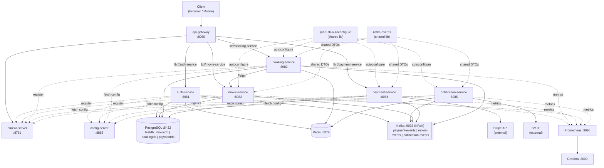
```mermaid
graph TD
    Client["Client\n(Browser / Mobile)"]
    Gateway["api-gateway\n:8080"]
    Eureka["eureka-server\n:8761"]
    Config["config-server\n:8888"]

    AuthSvc["auth-service\n:8081"]
    MovieSvc["movie-service\n:8082"]
    BookingSvc["booking-service\n:8083"]
    PaymentSvc["payment-service\n:8084"]
    NotifSvc["notification-service\n:8085"]

    PG[("PostgreSQL :5432\ntestdb | moviedb | bookingdb | paymentdb")]
    Redis[("Redis :6379")]
    Kafka[["Kafka :9092 (KRaft)\npayment-events | movie-events | notification-events"]]
    Stripe["Stripe API\n(external)"]
    SMTP["SMTP\n(external)"]

    Prometheus["Prometheus :9090"]
    Grafana["Grafana :3000"]

    JwtStarter["jwt-auth-autoconfigure\n(shared lib)"]
    KafkaEvents["kafka-events\n(shared lib)"]

    Client --> Gateway
    Gateway --> Eureka
    Gateway -->|lb://auth-service| AuthSvc
    Gateway -->|lb://movie-service| MovieSvc
    Gateway -->|lb://booking-service| BookingSvc
    Gateway -->|lb://payment-service| PaymentSvc

    AuthSvc --> PG
    AuthSvc --> Redis
    AuthSvc --> Kafka
    MovieSvc --> PG
    BookingSvc --> PG
    BookingSvc --> Redis
    BookingSvc -->|Feign| MovieSvc
    PaymentSvc --> PG
    PaymentSvc --> Stripe
    NotifSvc --> SMTP
    NotifSvc --> Redis
    NotifSvc --> Kafka

    MovieSvc --> Kafka
    PaymentSvc --> Kafka
    BookingSvc --> Kafka

    AuthSvc -.->|register| Eureka
    MovieSvc -.->|register| Eureka
    BookingSvc -.->|register| Eureka
    PaymentSvc -.->|register| Eureka
    NotifSvc -.->|register| Eureka

    AuthSvc -.->|fetch config| Config
    MovieSvc -.->|fetch config| Config
    BookingSvc -.->|fetch config| Config
    PaymentSvc -.->|fetch config| Config
    NotifSvc -.->|fetch config| Config

    MovieSvc -.->|metrics| Prometheus
    BookingSvc -.->|metrics| Prometheus
    PaymentSvc -.->|metrics| Prometheus
    AuthSvc -.->|metrics| Prometheus
    NotifSvc -.->|metrics| Prometheus
    Prometheus --> Grafana

    JwtStarter -.->|autoconfigure| MovieSvc
    JwtStarter -.->|autoconfigure| BookingSvc
    JwtStarter -.->|autoconfigure| PaymentSvc
    JwtStarter -.->|autoconfigure| NotifSvc
    KafkaEvents -.->|shared DTOs| MovieSvc
    KafkaEvents -.->|shared DTOs| BookingSvc
    KafkaEvents -.->|shared DTOs| PaymentSvc
    KafkaEvents -.->|shared DTOs| NotifSvc
```

---

### 1.2 Danh Mục Service

| Service | Port | Database | Dependency | Kafka Topic | Endpoint chính |
|---|---|---|---|---|---|
| api-gateway | 8080 | — | Eureka, config-server | — | Tất cả route |
| auth-service | 8081 | testdb (PostgreSQL), Redis | — | Produce: notification-events | /api/auth/**, /api/users/**, /api/auth/validate-token |
| movie-service | 8082 | moviedb (PostgreSQL) | — | Produce: movie-events | /api/movies/**, /api/showtimes/**, /api/theaters/**, /api/comments/** |
| booking-service | 8083 | bookingdb (PostgreSQL), Redis | movie-service (Feign) | Consume: payment-events | /api/bookings/** |
| payment-service | 8084 | paymentdb (PostgreSQL) | Stripe API | Produce: payment-events | /api/payments/** |
| notification-service | 8085 | Redis (chống trùng) | SMTP (Gmail) | Consume: notification-events | — (chỉ Kafka consumer) |
| eureka-server | 8761 | — | — | — | /eureka |
| config-server | 8888 | — | Config repo | — | /actuator |
| PostgreSQL | 5432 | testdb, moviedb, bookingdb | — | — | — |
| Redis | 6379 | — | — | — | — |
| Kafka (KRaft) | 9092 | — | — | payment-events, movie-events, notification-events | — |
| Prometheus | 9090 | — | — | — | /metrics |
| Grafana | 3000 | — | Prometheus | — | Dashboard |

**Bảng Route Gateway:**

| Mẫu đường dẫn | Service đích |
|---|---|
| /api/auth/** | lb://auth-service |
| /api/users/** | lb://auth-service |
| /api/movies/** | lb://movie-service |
| /api/showtimes/** | lb://movie-service |
| /api/theaters/** | lb://movie-service |
| /api/comments/** | lb://movie-service |
| /api/bookings/** | lb://booking-service |
| /api/payments/** | lb://payment-service |

---

### 1.3 Bố Cục Hạ Tầng — Mạng Docker Compose

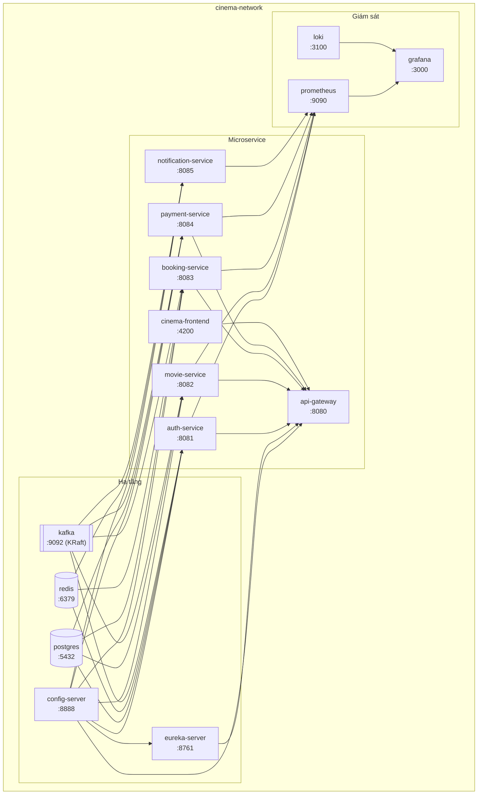
```mermaid
graph LR
    subgraph cinema-network
        direction LR
        subgraph infra["Hạ tầng"]
            PG[("postgres\n:5432")]
            Redis[("redis\n:6379")]
            Kafka[["kafka\n:9092 (KRaft)"]]
            Config["config-server\n:8888"]
            Eureka["eureka-server\n:8761"]
        end

        subgraph services["Microservice"]
            Auth["auth-service\n:8081"]
            Movie["movie-service\n:8082"]
            Booking["booking-service\n:8083"]
            Payment["payment-service\n:8084"]
            Notif["notification-service\n:8085"]
            Gateway["api-gateway\n:8080"]
            Frontend["cinema-frontend\n:4200"]
        end

        subgraph observability["Giám sát"]
            Prometheus["prometheus\n:9090"]
            Grafana["grafana\n:3000"]
            Loki["loki\n:3100"]
        end
    end

    Config --> Eureka
    Config --> Auth
    Config --> Movie
    Config --> Booking
    Config --> Payment
    Config --> Notif
    Config --> Gateway
    Eureka --> Gateway
    PG --> Auth
    PG --> Movie
    PG --> Booking
    PG --> Payment
    Redis --> Auth
    Redis --> Booking
    Redis --> Notif
    Kafka --> Auth
    Kafka --> Movie
    Kafka --> Booking
    Kafka --> Payment
    Kafka --> Notif
    Auth --> Gateway
    Movie --> Gateway
    Booking --> Gateway
    Payment --> Gateway
    Frontend --> Gateway
    Auth --> Prometheus
    Movie --> Prometheus
    Booking --> Prometheus
    Payment --> Prometheus
    Notif --> Prometheus
    Prometheus --> Grafana
    Loki --> Grafana
```

---

### 1.4 Tổng Quan Luồng Dữ Liệu

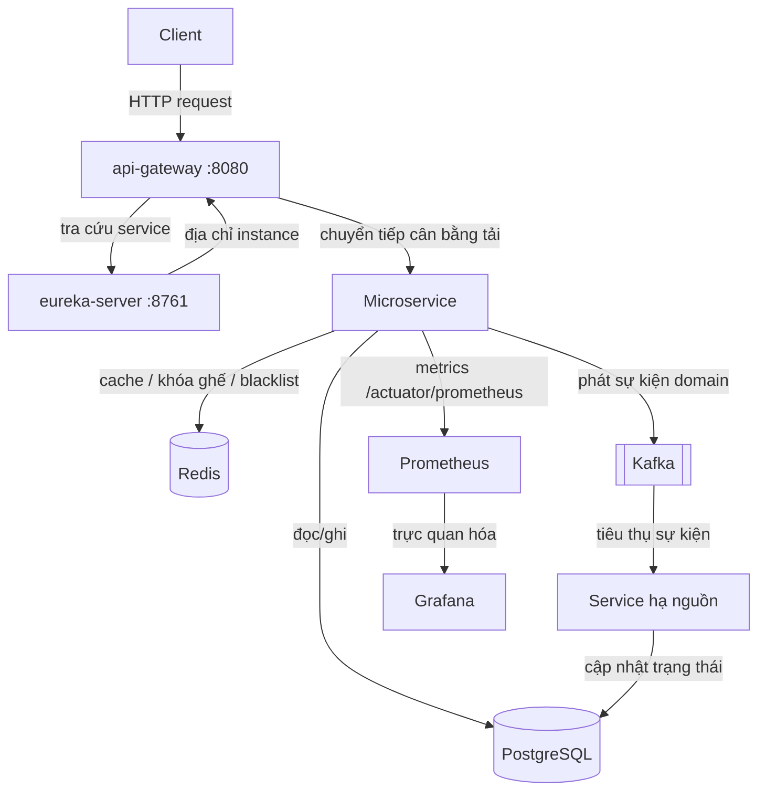
```mermaid
flowchart TD
    C["Client"] -->|HTTP request| GW["api-gateway :8080"]
    GW -->|tra cứu service| EU["eureka-server :8761"]
    EU -->|địa chỉ instance| GW
    GW -->|chuyển tiếp cân bằng tải| SVC["Microservice"]

    SVC -->|đọc/ghi| DB[("PostgreSQL")]
    SVC -->|cache / khóa ghế / blacklist| RD[("Redis")]
    SVC -->|phát sự kiện domain| KF[["Kafka"]]
    KF -->|tiêu thụ sự kiện| SVC2["Service hạ nguồn"]
    SVC2 -->|cập nhật trạng thái| DB

    SVC -->|metrics /actuator/prometheus| PR["Prometheus"]
    PR -->|trực quan hóa| GR["Grafana"]
```

---

## 2. Luồng Auth Service

### 2.1 Đăng Ký Người Dùng

`POST /api/auth/register`

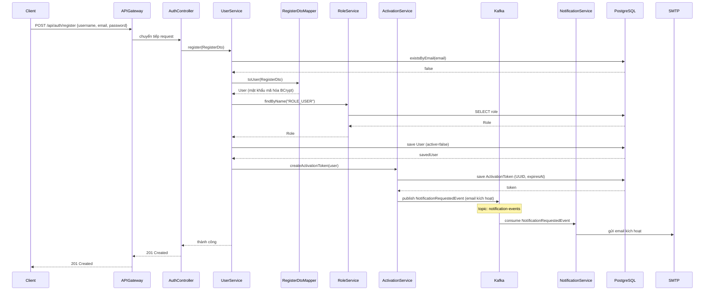
```mermaid
sequenceDiagram
    participant Client
    participant APIGateway
    participant AuthController
    participant UserService
    participant RegisterDtoMapper
    participant RoleService
    participant ActivationService
    participant Kafka
    participant NotificationService
    participant PostgreSQL
    participant SMTP

    Client->>APIGateway: POST /api/auth/register {username, email, password}
    APIGateway->>AuthController: chuyển tiếp request
    AuthController->>UserService: register(RegisterDto)
    UserService->>PostgreSQL: existsByEmail(email)
    PostgreSQL-->>UserService: false

    UserService->>RegisterDtoMapper: toUser(RegisterDto)
    RegisterDtoMapper-->>UserService: User (mật khẩu mã hóa BCrypt)

    UserService->>RoleService: findByName("ROLE_USER")
    RoleService->>PostgreSQL: SELECT role
    PostgreSQL-->>RoleService: Role
    RoleService-->>UserService: Role

    UserService->>PostgreSQL: save User (active=false)
    PostgreSQL-->>UserService: savedUser

    UserService->>ActivationService: createActivationToken(user)
    ActivationService->>PostgreSQL: save ActivationToken (UUID, expiresAt)
    PostgreSQL-->>ActivationService: token

    ActivationService->>Kafka: publish NotificationRequestedEvent (email kích hoạt)
    Note over Kafka: topic: notification-events
    Kafka->>NotificationService: consume NotificationRequestedEvent
    NotificationService->>SMTP: gửi email kích hoạt

    UserService-->>AuthController: thành công
    AuthController-->>APIGateway: 201 Created
    APIGateway-->>Client: 201 Created
```

---

### 2.2 Kích Hoạt Email

`GET /api/auth/activate?token=uuid`

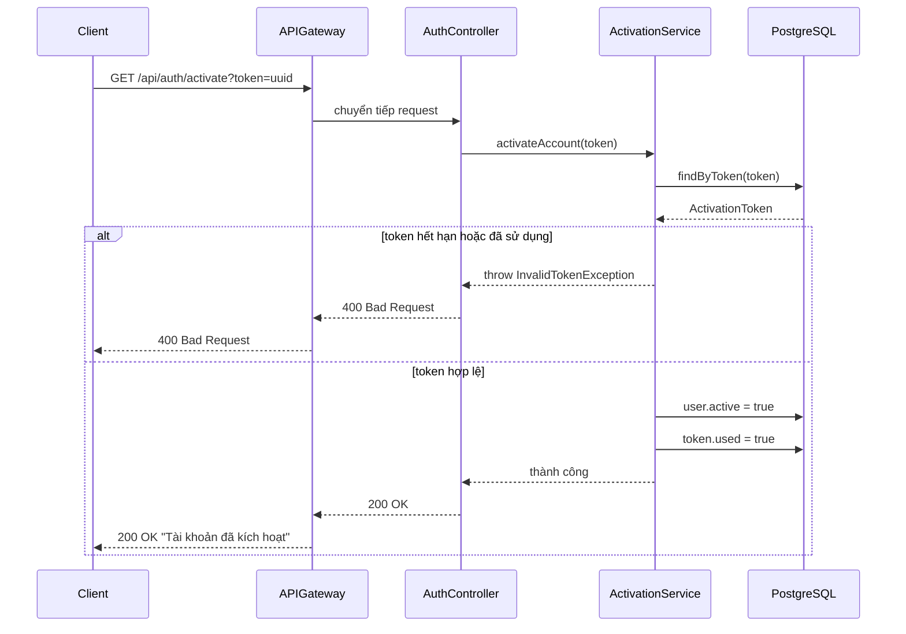
```mermaid
sequenceDiagram
    participant Client
    participant APIGateway
    participant AuthController
    participant ActivationService
    participant PostgreSQL

    Client->>APIGateway: GET /api/auth/activate?token=uuid
    APIGateway->>AuthController: chuyển tiếp request
    AuthController->>ActivationService: activateAccount(token)
    ActivationService->>PostgreSQL: findByToken(token)
    PostgreSQL-->>ActivationService: ActivationToken

    alt token hết hạn hoặc đã sử dụng
        ActivationService-->>AuthController: throw InvalidTokenException
        AuthController-->>APIGateway: 400 Bad Request
        APIGateway-->>Client: 400 Bad Request
    else token hợp lệ
        ActivationService->>PostgreSQL: user.active = true
        ActivationService->>PostgreSQL: token.used = true
        ActivationService-->>AuthController: thành công
        AuthController-->>APIGateway: 200 OK
        APIGateway-->>Client: 200 OK "Tài khoản đã kích hoạt"
    end
```

---

### 2.3 Đăng Nhập

`POST /api/auth/login`

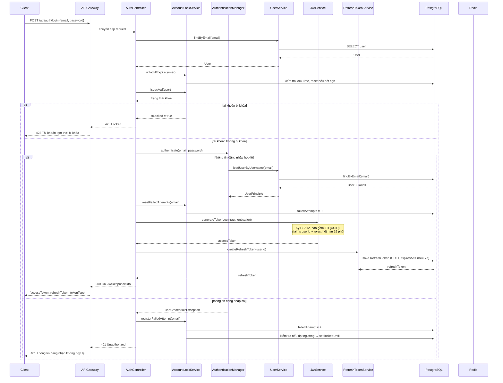
```mermaid
sequenceDiagram
    participant Client
    participant APIGateway
    participant AuthController
    participant AccountLockService
    participant AuthenticationManager
    participant UserService
    participant JwtService
    participant RefreshTokenService
    participant PostgreSQL
    participant Redis

    Client->>APIGateway: POST /api/auth/login {email, password}
    APIGateway->>AuthController: chuyển tiếp request
    AuthController->>UserService: findByEmail(email)
    UserService->>PostgreSQL: SELECT user
    PostgreSQL-->>UserService: User
    UserService-->>AuthController: User

    AuthController->>AccountLockService: unlockIfExpired(user)
    AccountLockService->>PostgreSQL: kiểm tra lockTime, reset nếu hết hạn

    AuthController->>AccountLockService: isLocked(user)
    AccountLockService-->>AuthController: trạng thái khóa

    alt tài khoản bị khóa
        AccountLockService-->>AuthController: isLocked = true
        AuthController-->>APIGateway: 423 Locked
        APIGateway-->>Client: 423 Tài khoản tạm thời bị khóa
    else tài khoản không bị khóa
        AuthController->>AuthenticationManager: authenticate(email, password)

        alt thông tin đăng nhập hợp lệ
            AuthenticationManager->>UserService: loadUserByUsername(email)
            UserService->>PostgreSQL: findByEmail(email)
            PostgreSQL-->>UserService: User + Roles
            UserService-->>AuthenticationManager: UserPrinciple

            AuthController->>AccountLockService: resetFailedAttempts(email)
            AccountLockService->>PostgreSQL: failedAttempts = 0

            AuthController->>JwtService: generateTokenLogin(authentication)
            Note over JwtService: Ký HS512, bao gồm JTI (UUID),<br/>claims userId + roles, hết hạn 15 phút
            JwtService-->>AuthController: accessToken

            AuthController->>RefreshTokenService: createRefreshToken(userId)
            RefreshTokenService->>PostgreSQL: save RefreshToken (UUID, expiresAt = now+7d)
            PostgreSQL-->>RefreshTokenService: refreshToken
            RefreshTokenService-->>AuthController: refreshToken

            AuthController-->>APIGateway: 200 OK JwtResponseDto
            APIGateway-->>Client: {accessToken, refreshToken, tokenType}

        else thông tin đăng nhập sai
            AuthenticationManager-->>AuthController: BadCredentialsException
            AuthController->>AccountLockService: registerFailedAttempt(email)
            AccountLockService->>PostgreSQL: failedAttempts++
            AccountLockService->>PostgreSQL: kiểm tra nếu đạt ngưỡng → set lockedUntil
            AuthController-->>APIGateway: 401 Unauthorized
            APIGateway-->>Client: 401 Thông tin đăng nhập không hợp lệ
        end
    end
```

---

### 2.4 Làm Mới Token

`POST /api/auth/refresh-token`

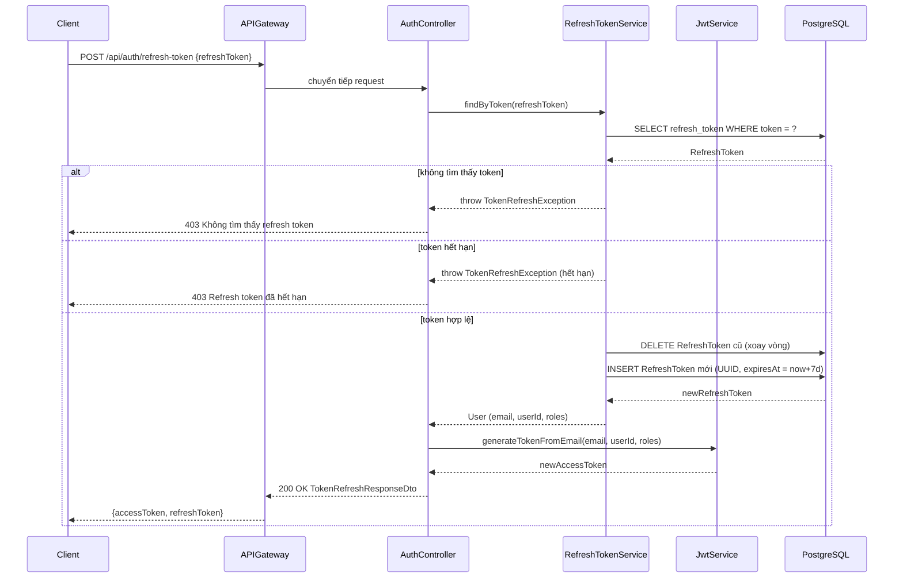
```mermaid
sequenceDiagram
    participant Client
    participant APIGateway
    participant AuthController
    participant RefreshTokenService
    participant JwtService
    participant PostgreSQL

    Client->>APIGateway: POST /api/auth/refresh-token {refreshToken}
    APIGateway->>AuthController: chuyển tiếp request
    AuthController->>RefreshTokenService: findByToken(refreshToken)
    RefreshTokenService->>PostgreSQL: SELECT refresh_token WHERE token = ?
    PostgreSQL-->>RefreshTokenService: RefreshToken

    alt không tìm thấy token
        RefreshTokenService-->>AuthController: throw TokenRefreshException
        AuthController-->>Client: 403 Không tìm thấy refresh token
    else token hết hạn
        RefreshTokenService-->>AuthController: throw TokenRefreshException (hết hạn)
        AuthController-->>Client: 403 Refresh token đã hết hạn
    else token hợp lệ
        RefreshTokenService->>PostgreSQL: DELETE RefreshToken cũ (xoay vòng)
        RefreshTokenService->>PostgreSQL: INSERT RefreshToken mới (UUID, expiresAt = now+7d)
        PostgreSQL-->>RefreshTokenService: newRefreshToken

        RefreshTokenService-->>AuthController: User (email, userId, roles)
        AuthController->>JwtService: generateTokenFromEmail(email, userId, roles)
        JwtService-->>AuthController: newAccessToken

        AuthController-->>APIGateway: 200 OK TokenRefreshResponseDto
        APIGateway-->>Client: {accessToken, refreshToken}
    end
```

---

### 2.5 Quên & Đặt Lại Mật Khẩu

`POST /api/auth/forgot-password` + `POST /api/auth/reset-password`

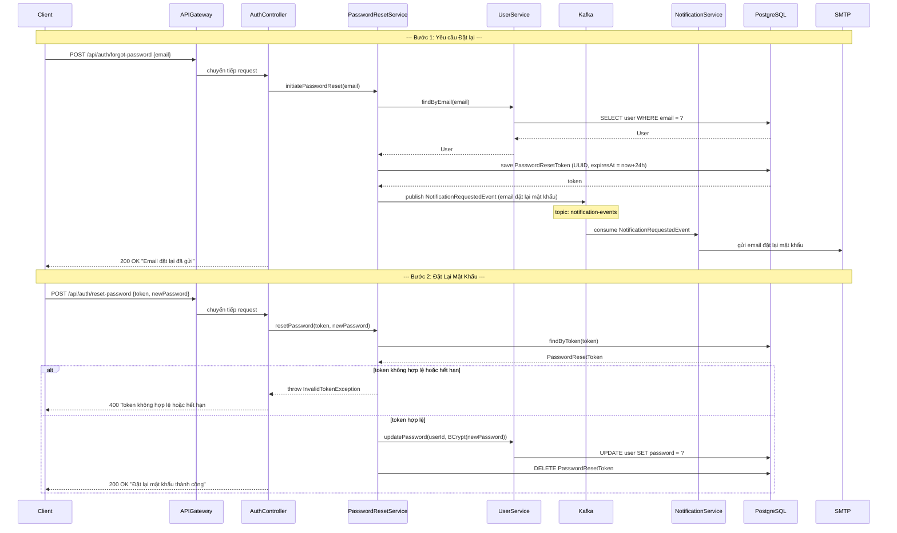
```mermaid
sequenceDiagram
    participant Client
    participant APIGateway
    participant AuthController
    participant PasswordResetService
    participant UserService
    participant Kafka
    participant NotificationService
    participant PostgreSQL
    participant SMTP

    Note over Client,SMTP: --- Bước 1: Yêu cầu Đặt lại ---

    Client->>APIGateway: POST /api/auth/forgot-password {email}
    APIGateway->>AuthController: chuyển tiếp request
    AuthController->>PasswordResetService: initiatePasswordReset(email)
    PasswordResetService->>UserService: findByEmail(email)
    UserService->>PostgreSQL: SELECT user WHERE email = ?
    PostgreSQL-->>UserService: User
    UserService-->>PasswordResetService: User

    PasswordResetService->>PostgreSQL: save PasswordResetToken (UUID, expiresAt = now+24h)
    PostgreSQL-->>PasswordResetService: token

    PasswordResetService->>Kafka: publish NotificationRequestedEvent (email đặt lại mật khẩu)
    Note over Kafka: topic: notification-events
    Kafka->>NotificationService: consume NotificationRequestedEvent
    NotificationService->>SMTP: gửi email đặt lại mật khẩu
    AuthController-->>Client: 200 OK "Email đặt lại đã gửi"

    Note over Client,SMTP: --- Bước 2: Đặt Lại Mật Khẩu ---

    Client->>APIGateway: POST /api/auth/reset-password {token, newPassword}
    APIGateway->>AuthController: chuyển tiếp request
    AuthController->>PasswordResetService: resetPassword(token, newPassword)
    PasswordResetService->>PostgreSQL: findByToken(token)
    PostgreSQL-->>PasswordResetService: PasswordResetToken

    alt token không hợp lệ hoặc hết hạn
        PasswordResetService-->>AuthController: throw InvalidTokenException
        AuthController-->>Client: 400 Token không hợp lệ hoặc hết hạn
    else token hợp lệ
        PasswordResetService->>UserService: updatePassword(userId, BCrypt(newPassword))
        UserService->>PostgreSQL: UPDATE user SET password = ?
        PasswordResetService->>PostgreSQL: DELETE PasswordResetToken
        AuthController-->>Client: 200 OK "Đặt lại mật khẩu thành công"
    end
```

---

### 2.6 Đăng Xuất

`POST /api/auth/logout`

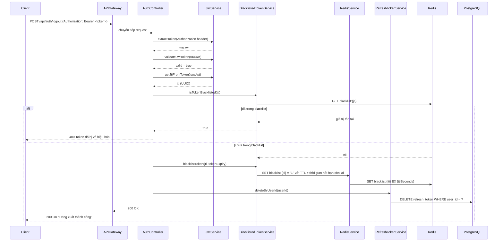
```mermaid
sequenceDiagram
    participant Client
    participant APIGateway
    participant AuthController
    participant JwtService
    participant BlacklistedTokenService
    participant RedisService
    participant RefreshTokenService
    participant Redis
    participant PostgreSQL

    Client->>APIGateway: POST /api/auth/logout {Authorization: Bearer <token>}
    APIGateway->>AuthController: chuyển tiếp request
    AuthController->>JwtService: extractToken(Authorization header)
    JwtService-->>AuthController: rawJwt

    AuthController->>JwtService: validateJwtToken(rawJwt)
    JwtService-->>AuthController: valid = true

    AuthController->>JwtService: getJtiFromToken(rawJwt)
    JwtService-->>AuthController: jti (UUID)

    AuthController->>BlacklistedTokenService: isTokenBlacklisted(jti)
    BlacklistedTokenService->>Redis: GET blacklist:{jti}

    alt đã trong blacklist
        Redis-->>BlacklistedTokenService: giá trị tồn tại
        BlacklistedTokenService-->>AuthController: true
        AuthController-->>Client: 400 Token đã bị vô hiệu hóa
    else chưa trong blacklist
        Redis-->>BlacklistedTokenService: nil
        AuthController->>BlacklistedTokenService: blacklistToken(jti, tokenExpiry)
        BlacklistedTokenService->>RedisService: SET blacklist:{jti} = "1" với TTL = thời gian hết hạn còn lại
        RedisService->>Redis: SET blacklist:{jti} EX {ttlSeconds}

        AuthController->>RefreshTokenService: deleteByUserId(userId)
        RefreshTokenService->>PostgreSQL: DELETE refresh_token WHERE user_id = ?

        AuthController-->>APIGateway: 200 OK
        APIGateway-->>Client: 200 OK "Đăng xuất thành công"
    end
```

---

### 2.7 Xác Thực Token (Giữa Các Microservice)

`POST /api/auth/validate-token`

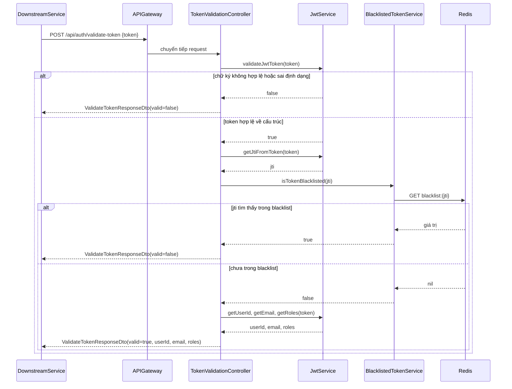
```mermaid
sequenceDiagram
    participant DownstreamService
    participant APIGateway
    participant TokenValidationController
    participant JwtService
    participant BlacklistedTokenService
    participant Redis

    DownstreamService->>APIGateway: POST /api/auth/validate-token {token}
    APIGateway->>TokenValidationController: chuyển tiếp request
    TokenValidationController->>JwtService: validateJwtToken(token)

    alt chữ ký không hợp lệ hoặc sai định dạng
        JwtService-->>TokenValidationController: false
        TokenValidationController-->>DownstreamService: ValidateTokenResponseDto(valid=false)
    else token hợp lệ về cấu trúc
        JwtService-->>TokenValidationController: true
        TokenValidationController->>JwtService: getJtiFromToken(token)
        JwtService-->>TokenValidationController: jti

        TokenValidationController->>BlacklistedTokenService: isTokenBlacklisted(jti)
        BlacklistedTokenService->>Redis: GET blacklist:{jti}

        alt jti tìm thấy trong blacklist
            Redis-->>BlacklistedTokenService: giá trị
            BlacklistedTokenService-->>TokenValidationController: true
            TokenValidationController-->>DownstreamService: ValidateTokenResponseDto(valid=false)
        else chưa trong blacklist
            Redis-->>BlacklistedTokenService: nil
            BlacklistedTokenService-->>TokenValidationController: false
            TokenValidationController->>JwtService: getUserId, getEmail, getRoles(token)
            JwtService-->>TokenValidationController: userId, email, roles
            TokenValidationController-->>DownstreamService: ValidateTokenResponseDto(valid=true, userId, email, roles)
        end
    end
```

---

## 3. Luồng Booking & Payment

### 3.1 Đặt Chỗ Ghế

`POST /api/bookings/reserve`

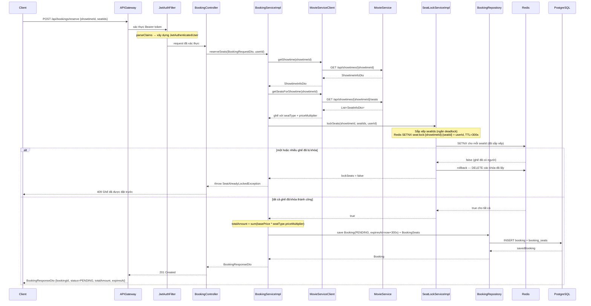
```mermaid
sequenceDiagram
    participant Client
    participant APIGateway
    participant JwtAuthFilter
    participant BookingController
    participant BookingServiceImpl
    participant MovieServiceClient
    participant MovieService
    participant SeatLockServiceImpl
    participant BookingRepository
    participant Redis
    participant PostgreSQL

    Client->>APIGateway: POST /api/bookings/reserve {showtimeId, seatIds}
    APIGateway->>JwtAuthFilter: xác thực Bearer token
    Note over JwtAuthFilter: parseClaims → xây dựng JwtAuthenticatedUser
    JwtAuthFilter->>BookingController: request đã xác thực

    BookingController->>BookingServiceImpl: reserveSeats(BookingRequestDto, userId)

    BookingServiceImpl->>MovieServiceClient: getShowtime(showtimeId)
    MovieServiceClient->>MovieService: GET /api/showtimes/{showtimeId}
    MovieService-->>MovieServiceClient: ShowtimeInfoDto
    MovieServiceClient-->>BookingServiceImpl: ShowtimeInfoDto

    BookingServiceImpl->>MovieServiceClient: getSeatsForShowtime(showtimeId)
    MovieServiceClient->>MovieService: GET /api/showtimes/{showtimeId}/seats
    MovieService-->>MovieServiceClient: List<SeatInfoDto>
    MovieServiceClient-->>BookingServiceImpl: ghế với seatType + priceMultiplier

    BookingServiceImpl->>SeatLockServiceImpl: lockSeats(showtimeId, seatIds, userId)
    Note over SeatLockServiceImpl: Sắp xếp seatIds (ngăn deadlock)<br/>Redis SETNX seat:lock:{showtimeId}:{seatId} = userId, TTL=300s
    SeatLockServiceImpl->>Redis: SETNX cho mỗi seatId (đã sắp xếp)

    alt một hoặc nhiều ghế đã bị khóa
        Redis-->>SeatLockServiceImpl: false (ghế đã có người)
        SeatLockServiceImpl->>Redis: rollback — DELETE các khóa đã lấy
        SeatLockServiceImpl-->>BookingServiceImpl: lockSeats = false
        BookingServiceImpl-->>BookingController: throw SeatAlreadyLockedException
        BookingController-->>Client: 409 Ghế đã được đặt trước
    else tất cả ghế đã khóa thành công
        Redis-->>SeatLockServiceImpl: true cho tất cả
        SeatLockServiceImpl-->>BookingServiceImpl: true

        Note over BookingServiceImpl: totalAmount = sum(basePrice * seatType.priceMultiplier)
        BookingServiceImpl->>BookingRepository: save Booking(PENDING, expiresAt=now+300s) + BookingSeats
        BookingRepository->>PostgreSQL: INSERT booking + booking_seats
        PostgreSQL-->>BookingRepository: savedBooking
        BookingRepository-->>BookingServiceImpl: Booking

        BookingServiceImpl-->>BookingController: BookingResponseDto
        BookingController-->>APIGateway: 201 Created
        APIGateway-->>Client: BookingResponseDto {bookingId, status=PENDING, totalAmount, expiresAt}
    end
```

---

### 3.2 Tạo Payment Intent

`POST /api/payments/create-intent`

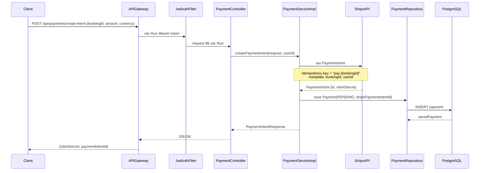
```mermaid
sequenceDiagram
    participant Client
    participant APIGateway
    participant JwtAuthFilter
    participant PaymentController
    participant PaymentServiceImpl
    participant StripeAPI
    participant PaymentRepository
    participant PostgreSQL

    Client->>APIGateway: POST /api/payments/create-intent {bookingId, amount, currency}
    APIGateway->>JwtAuthFilter: xác thực Bearer token
    JwtAuthFilter->>PaymentController: request đã xác thực

    PaymentController->>PaymentServiceImpl: createPaymentIntent(request, userId)

    PaymentServiceImpl->>StripeAPI: tạo PaymentIntent
    Note over PaymentServiceImpl,StripeAPI: idempotency key = "pay-{bookingId}"<br/>metadata: bookingId, userId
    StripeAPI-->>PaymentServiceImpl: PaymentIntent {id, clientSecret}

    PaymentServiceImpl->>PaymentRepository: save Payment(PENDING, stripePaymentIntentId)
    PaymentRepository->>PostgreSQL: INSERT payment
    PostgreSQL-->>PaymentRepository: savedPayment

    PaymentServiceImpl-->>PaymentController: PaymentIntentResponse
    PaymentController-->>APIGateway: 200 OK
    APIGateway-->>Client: {clientSecret, paymentIntentId}
```

---

### 3.3 Stripe Webhook → Kafka → Xác Nhận Booking

Luồng xác nhận thanh toán đầu cuối qua Stripe webhook.

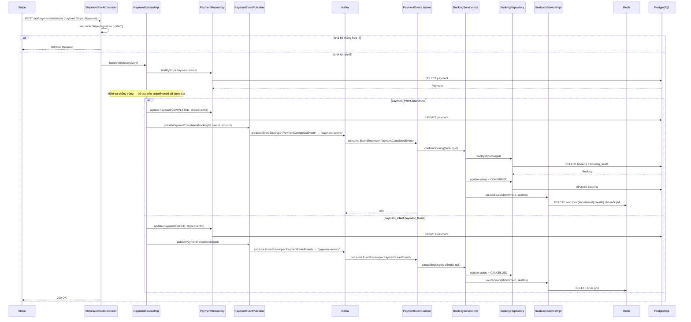
```mermaid
sequenceDiagram
    participant Stripe
    participant StripeWebhookController
    participant PaymentServiceImpl
    participant PaymentRepository
    participant PaymentEventPublisher
    participant Kafka
    participant PaymentEventListener
    participant BookingServiceImpl
    participant BookingRepository
    participant SeatLockServiceImpl
    participant Redis
    participant PostgreSQL

    Stripe->>StripeWebhookController: POST /api/payments/webhook {payload, Stripe-Signature}
    StripeWebhookController->>StripeWebhookController: xác minh Stripe-Signature (HMAC)

    alt chữ ký không hợp lệ
        StripeWebhookController-->>Stripe: 400 Bad Request
    else chữ ký hợp lệ
        StripeWebhookController->>PaymentServiceImpl: handleWebhook(event)
        PaymentServiceImpl->>PaymentRepository: findByStripePaymentIntentId
        PaymentRepository->>PostgreSQL: SELECT payment
        PostgreSQL-->>PaymentRepository: Payment

        Note over PaymentServiceImpl: kiểm tra chống trùng — bỏ qua nếu stripeEventId đã được set

        alt payment_intent.succeeded
            PaymentServiceImpl->>PaymentRepository: update Payment(COMPLETED, stripeEventId)
            PaymentRepository->>PostgreSQL: UPDATE payment
            PaymentServiceImpl->>PaymentEventPublisher: publishPaymentCompleted(bookingId, userId, amount)
            PaymentEventPublisher->>Kafka: produce EventEnvelope<PaymentCompletedEvent> → "payment-events"

            Kafka->>PaymentEventListener: consume EventEnvelope<PaymentCompletedEvent>
            PaymentEventListener->>BookingServiceImpl: confirmBooking(bookingId)
            BookingServiceImpl->>BookingRepository: findById(bookingId)
            BookingRepository->>PostgreSQL: SELECT booking + booking_seats
            PostgreSQL-->>BookingRepository: Booking
            BookingServiceImpl->>BookingRepository: update status = CONFIRMED
            BookingRepository->>PostgreSQL: UPDATE booking
            BookingServiceImpl->>SeatLockServiceImpl: unlockSeats(showtimeId, seatIds)
            SeatLockServiceImpl->>Redis: DELETE seat:lock:{showtimeId}:{seatId} cho mỗi ghế

            PaymentEventListener-->>Kafka: ack

        else payment_intent.payment_failed
            PaymentServiceImpl->>PaymentRepository: update Payment(FAILED, stripeEventId)
            PaymentRepository->>PostgreSQL: UPDATE payment
            PaymentServiceImpl->>PaymentEventPublisher: publishPaymentFailed(bookingId)
            PaymentEventPublisher->>Kafka: produce EventEnvelope<PaymentFailedEvent> → "payment-events"

            Kafka->>PaymentEventListener: consume EventEnvelope<PaymentFailedEvent>
            PaymentEventListener->>BookingServiceImpl: cancelBooking(bookingId, null)
            BookingServiceImpl->>BookingRepository: update status = CANCELLED
            BookingServiceImpl->>SeatLockServiceImpl: unlockSeats(showtimeId, seatIds)
            SeatLockServiceImpl->>Redis: DELETE khóa ghế
        end

        StripeWebhookController-->>Stripe: 200 OK
    end
```

---

### 3.4 Thanh Toán Giả Lập → Kafka → Xác Nhận Booking

`POST /api/payments/fake-success`

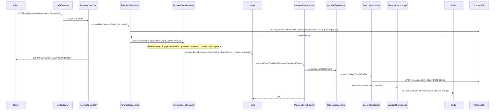
```mermaid
sequenceDiagram
    participant Client
    participant APIGateway
    participant PaymentController
    participant PaymentServiceImpl
    participant PaymentEventPublisher
    participant Kafka
    participant PaymentEventListener
    participant BookingServiceImpl
    participant BookingRepository
    participant SeatLockServiceImpl
    participant Redis
    participant PostgreSQL

    Client->>APIGateway: POST /api/payments/fake-success {bookingId}
    APIGateway->>PaymentController: chuyển tiếp request
    PaymentController->>PaymentServiceImpl: processFakePayment(bookingId, userId)

    PaymentServiceImpl->>PostgreSQL: save Payment(COMPLETED, stripePaymentIntentId="FAKE-{bookingId}-{ts}")
    PostgreSQL-->>PaymentServiceImpl: savedPayment

    PaymentServiceImpl->>PaymentEventPublisher: publishPaymentCompleted(bookingId, userId, amount)
    Note over PaymentEventPublisher: EventEnvelope.of("payment-service", "payment.completed", correlationId, payload)
    PaymentEventPublisher->>Kafka: produce EventEnvelope<PaymentCompletedEvent> → "payment-events"

    PaymentController-->>Client: 200 OK {paymentId, status=COMPLETED}

    Kafka->>PaymentEventListener: consume EventEnvelope<PaymentCompletedEvent>
    PaymentEventListener->>BookingServiceImpl: confirmBooking(bookingId)
    BookingServiceImpl->>BookingRepository: update Booking(CONFIRMED)
    BookingRepository->>PostgreSQL: UPDATE booking SET status = CONFIRMED
    BookingServiceImpl->>SeatLockServiceImpl: unlockSeats(showtimeId, seatIds)
    SeatLockServiceImpl->>Redis: DELETE seat:lock:{showtimeId}:{seatId} cho mỗi ghế
    PaymentEventListener-->>Kafka: ack
```

---

### 3.5 Bộ Lập Lịch Hết Hạn Booking

Dọn dẹp định kỳ các booking PENDING bị bỏ rơi.

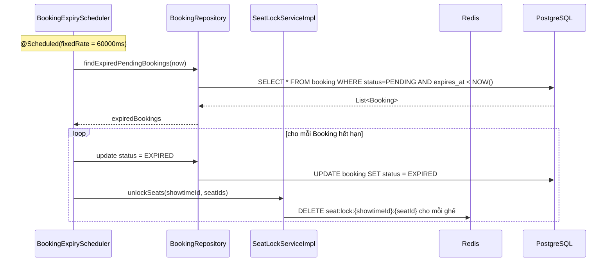
```mermaid
sequenceDiagram
    participant BookingExpiryScheduler
    participant BookingRepository
    participant SeatLockServiceImpl
    participant Redis
    participant PostgreSQL

    Note over BookingExpiryScheduler: @Scheduled(fixedRate = 60000ms)

    BookingExpiryScheduler->>BookingRepository: findExpiredPendingBookings(now)
    BookingRepository->>PostgreSQL: SELECT * FROM booking WHERE status=PENDING AND expires_at < NOW()
    PostgreSQL-->>BookingRepository: List<Booking>
    BookingRepository-->>BookingExpiryScheduler: expiredBookings

    loop cho mỗi Booking hết hạn
        BookingExpiryScheduler->>BookingRepository: update status = EXPIRED
        BookingRepository->>PostgreSQL: UPDATE booking SET status = EXPIRED

        BookingExpiryScheduler->>SeatLockServiceImpl: unlockSeats(showtimeId, seatIds)
        SeatLockServiceImpl->>Redis: DELETE seat:lock:{showtimeId}:{seatId} cho mỗi ghế
    end
```

---

## 4. Luồng Movie Service

### 4.1 Movie CRUD

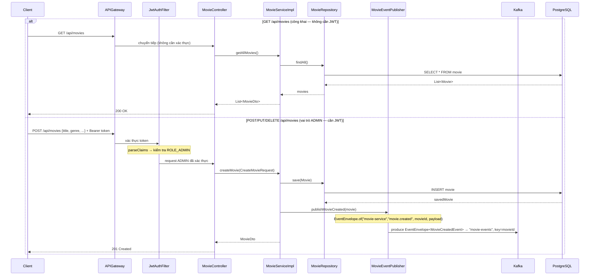
```mermaid
sequenceDiagram
    participant Client
    participant APIGateway
    participant JwtAuthFilter
    participant MovieController
    participant MovieServiceImpl
    participant MovieRepository
    participant MovieEventPublisher
    participant Kafka
    participant PostgreSQL

    alt GET /api/movies (công khai — không cần JWT)
        Client->>APIGateway: GET /api/movies
        APIGateway->>MovieController: chuyển tiếp (không cần xác thực)
        MovieController->>MovieServiceImpl: getAllMovies()
        MovieServiceImpl->>MovieRepository: findAll()
        MovieRepository->>PostgreSQL: SELECT * FROM movie
        PostgreSQL-->>MovieRepository: List<Movie>
        MovieRepository-->>MovieServiceImpl: movies
        MovieServiceImpl-->>MovieController: List<MovieDto>
        MovieController-->>Client: 200 OK

    else POST/PUT/DELETE /api/movies (vai trò ADMIN — cần JWT)
        Client->>APIGateway: POST /api/movies {title, genre, ...} + Bearer token
        APIGateway->>JwtAuthFilter: xác thực token
        Note over JwtAuthFilter: parseClaims → kiểm tra ROLE_ADMIN
        JwtAuthFilter->>MovieController: request ADMIN đã xác thực

        MovieController->>MovieServiceImpl: createMovie(CreateMovieRequest)
        MovieServiceImpl->>MovieRepository: save(Movie)
        MovieRepository->>PostgreSQL: INSERT movie
        PostgreSQL-->>MovieRepository: savedMovie

        MovieServiceImpl->>MovieEventPublisher: publishMovieCreated(movie)
        Note over MovieEventPublisher: EventEnvelope.of("movie-service","movie.created", movieId, payload)
        MovieEventPublisher->>Kafka: produce EventEnvelope<MovieCreatedEvent> → "movie-events", key=movieId

        MovieServiceImpl-->>MovieController: MovieDto
        MovieController-->>Client: 201 Created
    end
```

---

### 4.2 Showtime CRUD & Tình Trạng Ghế

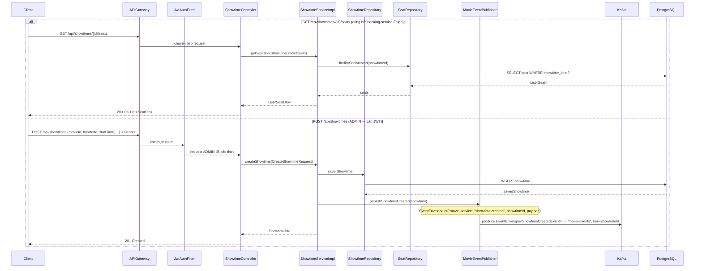
```mermaid
sequenceDiagram
    participant Client
    participant APIGateway
    participant JwtAuthFilter
    participant ShowtimeController
    participant ShowtimeServiceImpl
    participant ShowtimeRepository
    participant SeatRepository
    participant MovieEventPublisher
    participant Kafka
    participant PostgreSQL

    alt GET /api/showtimes/{id}/seats (dùng bởi booking-service Feign)
        Client->>APIGateway: GET /api/showtimes/{id}/seats
        APIGateway->>ShowtimeController: chuyển tiếp request
        ShowtimeController->>ShowtimeServiceImpl: getSeatsForShowtime(showtimeId)
        ShowtimeServiceImpl->>SeatRepository: findByShowtimeId(showtimeId)
        SeatRepository->>PostgreSQL: SELECT seat WHERE showtime_id = ?
        PostgreSQL-->>SeatRepository: List<Seat>
        SeatRepository-->>ShowtimeServiceImpl: seats
        ShowtimeServiceImpl-->>ShowtimeController: List<SeatDto>
        ShowtimeController-->>Client: 200 OK List<SeatDto>

    else POST /api/showtimes (ADMIN — cần JWT)
        Client->>APIGateway: POST /api/showtimes {movieId, theaterId, startTime, ...} + Bearer
        APIGateway->>JwtAuthFilter: xác thực token
        JwtAuthFilter->>ShowtimeController: request ADMIN đã xác thực

        ShowtimeController->>ShowtimeServiceImpl: createShowtime(CreateShowtimeRequest)
        ShowtimeServiceImpl->>ShowtimeRepository: save(Showtime)
        ShowtimeRepository->>PostgreSQL: INSERT showtime
        PostgreSQL-->>ShowtimeRepository: savedShowtime

        ShowtimeServiceImpl->>MovieEventPublisher: publishShowtimeCreated(showtime)
        Note over MovieEventPublisher: EventEnvelope.of("movie-service","showtime.created", showtimeId, payload)
        MovieEventPublisher->>Kafka: produce EventEnvelope<ShowtimeCreatedEvent> → "movie-events", key=showtimeId

        ShowtimeServiceImpl-->>ShowtimeController: ShowtimeDto
        ShowtimeController-->>Client: 201 Created
    end
```

---

### 4.3 Theater CRUD

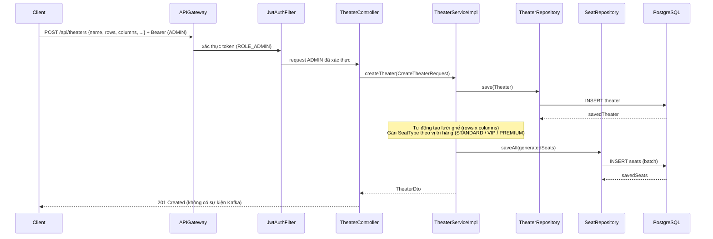
```mermaid
sequenceDiagram
    participant Client
    participant APIGateway
    participant JwtAuthFilter
    participant TheaterController
    participant TheaterServiceImpl
    participant TheaterRepository
    participant SeatRepository
    participant PostgreSQL

    Client->>APIGateway: POST /api/theaters {name, rows, columns, ...} + Bearer (ADMIN)
    APIGateway->>JwtAuthFilter: xác thực token (ROLE_ADMIN)
    JwtAuthFilter->>TheaterController: request ADMIN đã xác thực

    TheaterController->>TheaterServiceImpl: createTheater(CreateTheaterRequest)
    TheaterServiceImpl->>TheaterRepository: save(Theater)
    TheaterRepository->>PostgreSQL: INSERT theater
    PostgreSQL-->>TheaterRepository: savedTheater

    Note over TheaterServiceImpl: Tự động tạo lưới ghế (rows x columns)<br/>Gán SeatType theo vị trí hàng (STANDARD / VIP / PREMIUM)
    TheaterServiceImpl->>SeatRepository: saveAll(generatedSeats)
    SeatRepository->>PostgreSQL: INSERT seats (batch)
    PostgreSQL-->>SeatRepository: savedSeats

    TheaterServiceImpl-->>TheaterController: TheaterDto
    TheaterController-->>Client: 201 Created (không có sự kiện Kafka)
```

---

### 4.4 Đánh Giá Phim (Upsert)

`POST /api/movies/{movieId}/ratings` | `GET /api/movies/{movieId}/ratings`

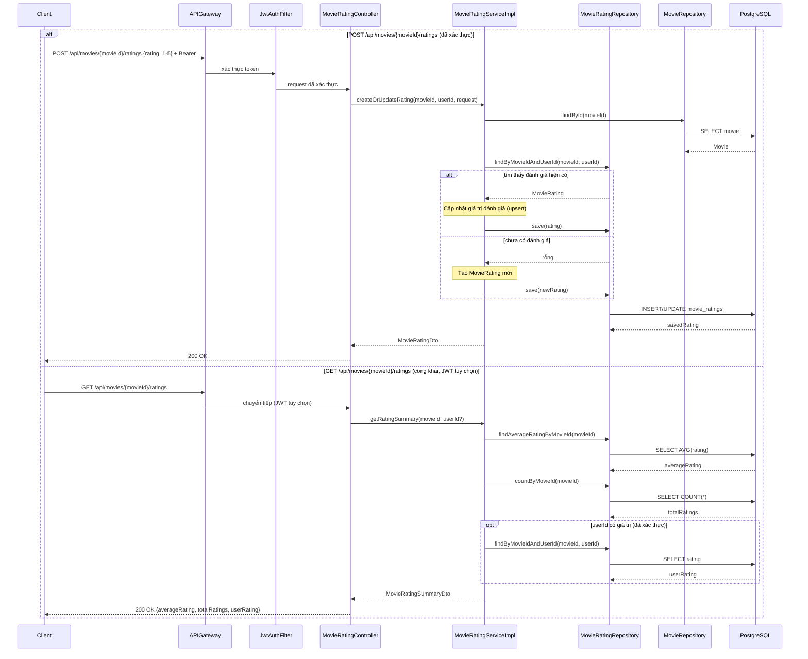
```mermaid
sequenceDiagram
    participant Client
    participant APIGateway
    participant JwtAuthFilter
    participant MovieRatingController
    participant MovieRatingServiceImpl
    participant MovieRatingRepository
    participant MovieRepository
    participant PostgreSQL

    alt POST /api/movies/{movieId}/ratings (đã xác thực)
        Client->>APIGateway: POST /api/movies/{movieId}/ratings {rating: 1-5} + Bearer
        APIGateway->>JwtAuthFilter: xác thực token
        JwtAuthFilter->>MovieRatingController: request đã xác thực
        MovieRatingController->>MovieRatingServiceImpl: createOrUpdateRating(movieId, userId, request)
        MovieRatingServiceImpl->>MovieRepository: findById(movieId)
        MovieRepository->>PostgreSQL: SELECT movie
        PostgreSQL-->>MovieRepository: Movie
        MovieRatingServiceImpl->>MovieRatingRepository: findByMovieIdAndUserId(movieId, userId)

        alt tìm thấy đánh giá hiện có
            MovieRatingRepository-->>MovieRatingServiceImpl: MovieRating
            Note over MovieRatingServiceImpl: Cập nhật giá trị đánh giá (upsert)
            MovieRatingServiceImpl->>MovieRatingRepository: save(rating)
        else chưa có đánh giá
            MovieRatingRepository-->>MovieRatingServiceImpl: rỗng
            Note over MovieRatingServiceImpl: Tạo MovieRating mới
            MovieRatingServiceImpl->>MovieRatingRepository: save(newRating)
        end

        MovieRatingRepository->>PostgreSQL: INSERT/UPDATE movie_ratings
        PostgreSQL-->>MovieRatingRepository: savedRating
        MovieRatingServiceImpl-->>MovieRatingController: MovieRatingDto
        MovieRatingController-->>Client: 200 OK

    else GET /api/movies/{movieId}/ratings (công khai, JWT tùy chọn)
        Client->>APIGateway: GET /api/movies/{movieId}/ratings
        APIGateway->>MovieRatingController: chuyển tiếp (JWT tùy chọn)
        MovieRatingController->>MovieRatingServiceImpl: getRatingSummary(movieId, userId?)
        MovieRatingServiceImpl->>MovieRatingRepository: findAverageRatingByMovieId(movieId)
        MovieRatingRepository->>PostgreSQL: SELECT AVG(rating)
        PostgreSQL-->>MovieRatingRepository: averageRating
        MovieRatingServiceImpl->>MovieRatingRepository: countByMovieId(movieId)
        MovieRatingRepository->>PostgreSQL: SELECT COUNT(*)
        PostgreSQL-->>MovieRatingRepository: totalRatings

        opt userId có giá trị (đã xác thực)
            MovieRatingServiceImpl->>MovieRatingRepository: findByMovieIdAndUserId(movieId, userId)
            MovieRatingRepository->>PostgreSQL: SELECT rating
            PostgreSQL-->>MovieRatingRepository: userRating
        end

        MovieRatingServiceImpl-->>MovieRatingController: MovieRatingSummaryDto
        MovieRatingController-->>Client: 200 OK {averageRating, totalRatings, userRating}
    end
```

---

### 4.5 Bình Luận Phim (CRUD với Soft-Delete)

`POST/GET /api/movies/{movieId}/comments` | `PUT/DELETE /api/comments/{commentId}`

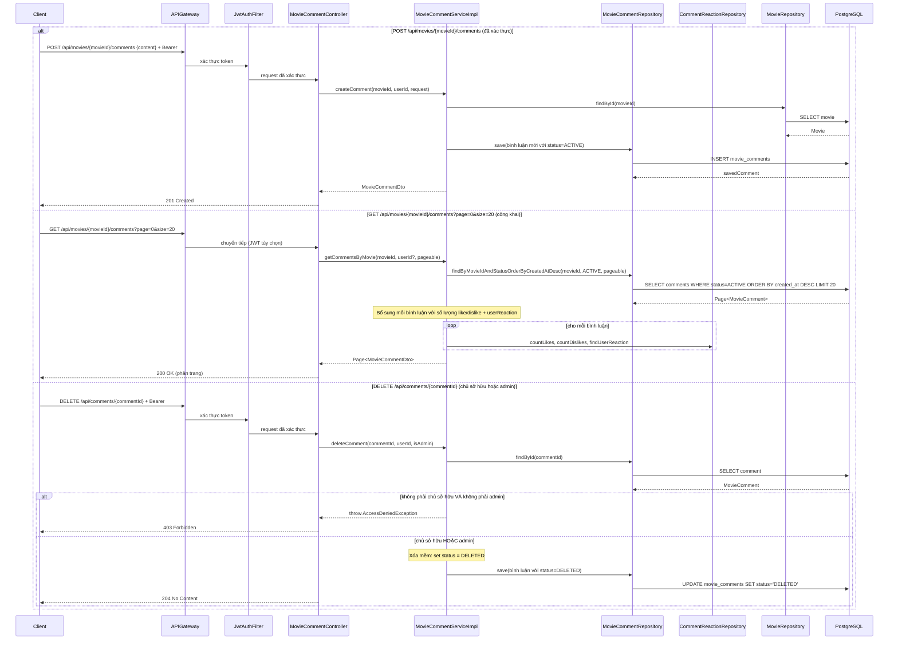
```mermaid
sequenceDiagram
    participant Client
    participant APIGateway
    participant JwtAuthFilter
    participant MovieCommentController
    participant MovieCommentServiceImpl
    participant MovieCommentRepository
    participant CommentReactionRepository
    participant MovieRepository
    participant PostgreSQL

    alt POST /api/movies/{movieId}/comments (đã xác thực)
        Client->>APIGateway: POST /api/movies/{movieId}/comments {content} + Bearer
        APIGateway->>JwtAuthFilter: xác thực token
        JwtAuthFilter->>MovieCommentController: request đã xác thực
        MovieCommentController->>MovieCommentServiceImpl: createComment(movieId, userId, request)
        MovieCommentServiceImpl->>MovieRepository: findById(movieId)
        MovieRepository->>PostgreSQL: SELECT movie
        PostgreSQL-->>MovieRepository: Movie
        MovieCommentServiceImpl->>MovieCommentRepository: save(bình luận mới với status=ACTIVE)
        MovieCommentRepository->>PostgreSQL: INSERT movie_comments
        PostgreSQL-->>MovieCommentRepository: savedComment
        MovieCommentServiceImpl-->>MovieCommentController: MovieCommentDto
        MovieCommentController-->>Client: 201 Created

    else GET /api/movies/{movieId}/comments?page=0&size=20 (công khai)
        Client->>APIGateway: GET /api/movies/{movieId}/comments?page=0&size=20
        APIGateway->>MovieCommentController: chuyển tiếp (JWT tùy chọn)
        MovieCommentController->>MovieCommentServiceImpl: getCommentsByMovie(movieId, userId?, pageable)
        MovieCommentServiceImpl->>MovieCommentRepository: findByMovieIdAndStatusOrderByCreatedAtDesc(movieId, ACTIVE, pageable)
        MovieCommentRepository->>PostgreSQL: SELECT comments WHERE status=ACTIVE ORDER BY created_at DESC LIMIT 20
        PostgreSQL-->>MovieCommentRepository: Page<MovieComment>
        Note over MovieCommentServiceImpl: Bổ sung mỗi bình luận với số lượng like/dislike + userReaction
        loop cho mỗi bình luận
            MovieCommentServiceImpl->>CommentReactionRepository: countLikes, countDislikes, findUserReaction
        end
        MovieCommentServiceImpl-->>MovieCommentController: Page<MovieCommentDto>
        MovieCommentController-->>Client: 200 OK (phân trang)

    else DELETE /api/comments/{commentId} (chủ sở hữu hoặc admin)
        Client->>APIGateway: DELETE /api/comments/{commentId} + Bearer
        APIGateway->>JwtAuthFilter: xác thực token
        JwtAuthFilter->>MovieCommentController: request đã xác thực
        MovieCommentController->>MovieCommentServiceImpl: deleteComment(commentId, userId, isAdmin)
        MovieCommentServiceImpl->>MovieCommentRepository: findById(commentId)
        MovieCommentRepository->>PostgreSQL: SELECT comment
        PostgreSQL-->>MovieCommentRepository: MovieComment

        alt không phải chủ sở hữu VÀ không phải admin
            MovieCommentServiceImpl-->>MovieCommentController: throw AccessDeniedException
            MovieCommentController-->>Client: 403 Forbidden
        else chủ sở hữu HOẶC admin
            Note over MovieCommentServiceImpl: Xóa mềm: set status = DELETED
            MovieCommentServiceImpl->>MovieCommentRepository: save(bình luận với status=DELETED)
            MovieCommentRepository->>PostgreSQL: UPDATE movie_comments SET status='DELETED'
            MovieCommentController-->>Client: 204 No Content
        end
    end
```

---

### 4.6 Phản Ứng Bình Luận (Chuyển Đổi Like/Dislike)

`POST/DELETE /api/comments/{commentId}/reactions`

```mermaid
sequenceDiagram
    participant Client
    participant APIGateway
    participant JwtAuthFilter
    participant CommentReactionController
    participant CommentReactionServiceImpl
    participant CommentReactionRepository
    participant MovieCommentRepository
    participant PostgreSQL

    Client->>APIGateway: POST /api/comments/{commentId}/reactions {isLike: true} + Bearer
    APIGateway->>JwtAuthFilter: xác thực token
    JwtAuthFilter->>CommentReactionController: request đã xác thực
    CommentReactionController->>CommentReactionServiceImpl: toggleReaction(commentId, userId, request)

    CommentReactionServiceImpl->>MovieCommentRepository: findById(commentId)
    MovieCommentRepository->>PostgreSQL: SELECT comment WHERE status=ACTIVE
    PostgreSQL-->>MovieCommentRepository: MovieComment

    CommentReactionServiceImpl->>CommentReactionRepository: findByCommentIdAndUserId(commentId, userId)
    CommentReactionRepository->>PostgreSQL: SELECT reaction
    PostgreSQL-->>CommentReactionRepository: Optional<CommentReaction>

    alt chưa có phản ứng
        Note over CommentReactionServiceImpl: Tạo phản ứng mới
        CommentReactionServiceImpl->>CommentReactionRepository: save(CommentReaction mới)
        CommentReactionRepository->>PostgreSQL: INSERT comment_reactions
    else cùng loại được nhấn (bật/tắt)
        Note over CommentReactionServiceImpl: Xóa phản ứng (xóa cứng)
        CommentReactionServiceImpl->>CommentReactionRepository: delete(existing)
        CommentReactionRepository->>PostgreSQL: DELETE FROM comment_reactions
    else loại khác (chuyển đổi)
        Note over CommentReactionServiceImpl: Chuyển like↔dislike
        CommentReactionServiceImpl->>CommentReactionRepository: save(phản ứng đã cập nhật)
        CommentReactionRepository->>PostgreSQL: UPDATE comment_reactions SET is_like=?
    end

    CommentReactionServiceImpl->>CommentReactionRepository: countLikes, countDislikes
    CommentReactionRepository->>PostgreSQL: SELECT COUNT(*)
    PostgreSQL-->>CommentReactionRepository: likeCount, dislikeCount
    CommentReactionServiceImpl-->>CommentReactionController: CommentReactionDto
    CommentReactionController-->>Client: 200 OK {commentId, likeCount, dislikeCount, userReaction}
```

---

## 5. Luồng Hạ Tầng

### 5.1 Định Tuyến API Gateway

```mermaid
sequenceDiagram
    participant Client
    participant APIGateway
    participant Eureka
    participant auth-service
    participant movie-service
    participant booking-service
    participant payment-service

    Client->>APIGateway: HTTP request với đường dẫn

    alt /api/auth/** hoặc /api/users/**
        APIGateway->>Eureka: tra cứu lb://auth-service
        Eureka-->>APIGateway: địa chỉ instance
        APIGateway->>auth-service: chuyển tiếp request
        auth-service-->>APIGateway: phản hồi
    else /api/movies/** hoặc /api/showtimes/** hoặc /api/theaters/** hoặc /api/comments/**
        APIGateway->>Eureka: tra cứu lb://movie-service
        Eureka-->>APIGateway: địa chỉ instance
        APIGateway->>movie-service: chuyển tiếp request
        movie-service-->>APIGateway: phản hồi
    else /api/bookings/**
        APIGateway->>Eureka: tra cứu lb://booking-service
        Eureka-->>APIGateway: địa chỉ instance
        APIGateway->>booking-service: chuyển tiếp request
        booking-service-->>APIGateway: phản hồi
    else /api/payments/**
        APIGateway->>Eureka: tra cứu lb://payment-service
        Eureka-->>APIGateway: địa chỉ instance
        APIGateway->>payment-service: chuyển tiếp request
        payment-service-->>APIGateway: phản hồi
    end

    APIGateway-->>Client: HTTP phản hồi
```

---

### 5.2 Khám Phá & Đăng Ký Service

```mermaid
sequenceDiagram
    participant Services
    participant EurekaServer

    Note over Services,EurekaServer: Giai đoạn Khởi động
    Services->>EurekaServer: POST /eureka/apps/{appName} (đăng ký)
    Note over Services: gửi: hostname, port, healthCheckUrl, status=UP
    EurekaServer-->>Services: 204 No Content (đã đăng ký)

    Note over Services,EurekaServer: Giai đoạn Heartbeat (mỗi 30 giây)
    loop mỗi 30 giây
        Services->>EurekaServer: PUT /eureka/apps/{appName}/{instanceId} (heartbeat)
        EurekaServer-->>Services: 200 OK
    end

    Note over Services,EurekaServer: Gateway Khám Phá
    Services->>EurekaServer: GET /eureka/apps (lấy registry)
    EurekaServer-->>Services: tất cả instance đã đăng ký

    Note over Services: api-gateway phân giải lb://service-name<br/>→ instance cân bằng tải từ registry
```

---

### 5.3 Khởi Tạo Config Server

```mermaid
sequenceDiagram
    participant ConfigServer
    participant ConfigRepo
    participant Services

    Note over ConfigServer,Services: Khởi động Ứng dụng

    Services->>ConfigServer: GET /config/{service-name}/{profile}
    Note over Services: bootstrap.yml trỏ đến URL config-server
    ConfigServer->>ConfigRepo: đọc tệp cấu hình
    ConfigRepo-->>ConfigServer: YAML / properties
    ConfigServer-->>Services: cấu hình đã gộp

    Note over Services: JWT secret chia sẻ được phân phối qua config-server.<br/>Tất cả service sử dụng cùng khóa ký HS512.

    Services->>Services: áp dụng cấu hình (DB URL, Kafka brokers, JWT secret, v.v.)
    Services->>Services: hoàn tất khởi tạo Spring context
```

---

### 5.4 Xử Lý Lỗi Kafka DLT

```mermaid
sequenceDiagram
    participant Kafka
    participant PaymentEventListener
    participant DefaultErrorHandler
    participant DeadLetterPublishingRecoverer
    participant KafkaDLT

    Kafka->>PaymentEventListener: consume EventEnvelope<PaymentCompletedEvent>

    alt đường dẫn thành công
        PaymentEventListener->>PaymentEventListener: xử lý sự kiện
        PaymentEventListener-->>Kafka: ack (commit offset)

    else xử lý thất bại (exception có thể thử lại)
        PaymentEventListener-->>DefaultErrorHandler: exception được ném
        Note over DefaultErrorHandler: ExponentialBackOffWithMaxRetries(3)<br/>1s → 2s → 4s, maxInterval=10s

        loop tối đa 3 lần thử lại
            DefaultErrorHandler->>PaymentEventListener: thử lại
            PaymentEventListener-->>DefaultErrorHandler: exception (lần nữa)
        end

        DefaultErrorHandler->>DeadLetterPublishingRecoverer: hết lần thử lại
        DeadLetterPublishingRecoverer->>KafkaDLT: produce tới "payment-events.DLT"
        Note over KafkaDLT: Header gốc được giữ + chi tiết lỗi được thêm

    else exception không thể thử lại
        Note over DefaultErrorHandler: SerializationException,<br/>MessageConversionException → không thử lại
        PaymentEventListener-->>DefaultErrorHandler: exception không thể thử lại
        DefaultErrorHandler->>DeadLetterPublishingRecoverer: publish tới DLT ngay lập tức
        DeadLetterPublishingRecoverer->>KafkaDLT: produce tới "payment-events.DLT"
    end
```

---

### 5.5 Bộ Lọc Xác Thực JWT Starter

```mermaid
sequenceDiagram
    participant Client
    participant JwtAuthenticationFilter
    participant JwtTokenValidator
    participant SecurityContext
    participant Controller

    Client->>JwtAuthenticationFilter: HTTP request

    JwtAuthenticationFilter->>JwtAuthenticationFilter: trích xuất Authorization header

    alt không có Bearer token hoặc đường dẫn công khai
        Note over JwtAuthenticationFilter: bỏ qua filter — để Spring Security quyết định
        JwtAuthenticationFilter->>Controller: chuyển tiếp chưa xác thực
    else có Bearer token
        JwtAuthenticationFilter->>JwtTokenValidator: parseClaims(jwt)
        Note over JwtTokenValidator: Xác minh chữ ký HS512<br/>kiểm tra hết hạn — không tra cứu DB hoặc blacklist

        alt token không hợp lệ (sai chữ ký / hết hạn)
            JwtTokenValidator-->>JwtAuthenticationFilter: claims null
            JwtAuthenticationFilter->>Controller: chuyển tiếp chưa xác thực (Spring trả về 401)
        else token hợp lệ
            JwtTokenValidator-->>JwtAuthenticationFilter: Claims

            JwtAuthenticationFilter->>JwtTokenValidator: getEmail(claims)
            JwtAuthenticationFilter->>JwtTokenValidator: getUserId(claims)
            JwtAuthenticationFilter->>JwtTokenValidator: getRoles(claims)
            JwtTokenValidator-->>JwtAuthenticationFilter: email, userId, List<String> roles

            JwtAuthenticationFilter->>JwtAuthenticationFilter: xây dựng JwtAuthenticatedUser(userId, email, roles)
            JwtAuthenticationFilter->>SecurityContext: setAuthentication(UsernamePasswordAuthenticationToken)

            JwtAuthenticationFilter->>Controller: chuyển tiếp đã xác thực
            Controller-->>Client: 200 OK phản hồi
        end
    end
```

---

## 6. Bảng Tham Chiếu

### 6.1 Schema EventEnvelope

| Trường | Kiểu | Mô tả |
|---|---|---|
| `eventId` | `String` (UUID) | Định danh duy nhất cho instance sự kiện này (tự động tạo) |
| `eventType` | `String` | Mô tả phân cách bằng dấu chấm, ví dụ `payment.completed` |
| `source` | `String` | Service gốc, ví dụ `payment-service` |
| `correlationId` | `String` | ID saga/trace được truyền cho distributed tracing |
| `timestamp` | `LocalDateTime` | Thời điểm tạo sự kiện (tự động tạo) |
| `payload` | `<T>` | Payload sự kiện theo domain cụ thể (generic) |

**Factory method:** `EventEnvelope.of(source, eventType, correlationId, payload)` — tự động điền `eventId` (UUID) và `timestamp`.

---

### 6.2 Danh Mục Kafka Topic

| Hằng số | Tên Topic | Partition | Producer | Consumer |
|---|---|---|---|---|
| `KafkaTopics.PAYMENT_EVENTS` | `payment-events` | — | payment-service | booking-service |
| `KafkaTopics.MOVIE_EVENTS` | `movie-events` | — | movie-service | — (consumer tương lai) |
| `KafkaTopics.NOTIFICATION_EVENTS` | `notification-events` | — | auth-service | notification-service |
| *(DLT)* | `payment-events.DLT` | — | DefaultErrorHandler | kiểm tra thủ công |

---

### 6.3 Danh Mục Loại Sự Kiện

| Loại sự kiện | Lớp Payload | Topic | Phát bởi | Tiêu thụ bởi |
|---|---|---|---|---|
| `payment.completed` | `PaymentCompletedEvent` | `payment-events` | payment-service | booking-service |
| `payment.failed` | `PaymentFailedEvent` | `payment-events` | payment-service | booking-service |
| `movie.created` | `MovieCreatedEvent` | `movie-events` | movie-service | *(tương lai)* |
| `showtime.created` | `ShowtimeCreatedEvent` | `movie-events` | movie-service | *(tương lai)* |
| `notification.requested` | `NotificationRequestedEvent` | `notification-events` | auth-service | notification-service |

---

### 6.4 Mẫu Redis Key

| Mẫu | Sở hữu bởi | TTL | Mục đích |
|---|---|---|---|
| `blacklist:{jti}` | auth-service | Thời gian hết hạn JWT còn lại | Blacklist access token (RedisKeyPrefix.BLACKLIST) |
| `seat:lock:{showtimeId}:{seatId}` | booking-service | 300s (5 phút) | Khóa đặt chỗ ghế tạm thời (SETNX) |
| `notification:processed:{eventId}` | notification-service | 24 giờ | Chống trùng sự kiện (SETNX, fail-open) |

> **Lưu ý:** Khóa tài khoản sử dụng trường database (`User.lockTime`, `User.failedAttempts`), không sử dụng Redis.

---

### 6.5 Máy Trạng Thái BookingStatus

```mermaid
graph TD
    PENDING["PENDING\n(ghế đã khóa, chờ thanh toán)"]
    CONFIRMED["CONFIRMED\n(đã nhận thanh toán)"]
    EXPIRED["EXPIRED\n(hết thời gian hoặc thanh toán thất bại)"]
    CANCELLED["CANCELLED\n(người dùng đã hủy)"]

    PENDING -->|sự kiện payment.completed| CONFIRMED
    PENDING -->|sự kiện payment.failed| CANCELLED
    PENDING -->|expiresAt < now (scheduler)| EXPIRED
    CONFIRMED -->|người dùng yêu cầu hoàn tiền| CANCELLED
```
