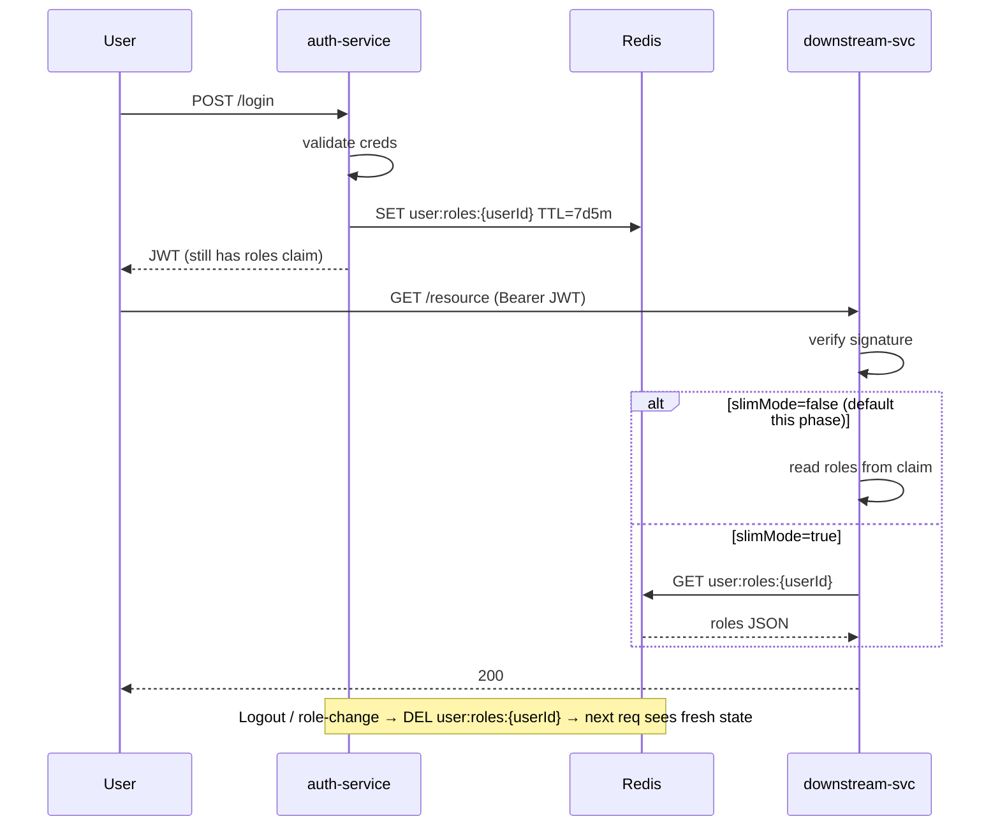

# Phase 01 — Redis Role Store + Dual-Mode Filter

## Context links
- Parent: [plan.md](./plan.md)
- Brainstorm: [/plans/reports/brainstorm-260513-1615-jwt-roles-bloat-revocation.md](../reports/brainstorm-260513-1615-jwt-roles-bloat-revocation.md)
- Research: [research/researcher-01-codebase-inventory.md](./research/researcher-01-codebase-inventory.md), [research/researcher-02-tech-patterns.md](./research/researcher-02-tech-patterns.md)
- Depends on: none (first phase)

## Overview
- **Date:** 2026-05-13
- **Description:** Auth-service writes roles to Redis on login/refresh; deletes/overwrites on logout & role-change. `jwt-auth-autoconfigure` gains a Redis-backed role lookup with feature flag `namnd.jwt.slim-mode` (default false). All 5 downstream services gain Redis dep + config. Backwards-compat — claim still emitted, slim-mode off everywhere.
- **Priority:** P1
- **Impl status:** pending
- **Review status:** pending

## Key Insights
1. Researcher-01: no downstream service has `spring-data-redis` yet — must add to booking, movie, payment, notification, audit.
2. No `RoleController` in codebase — Phase 1 introduces `AdminRoleController` (`POST /api/admin/users/{userId}/roles`, `@PreAuthorize("hasRole('ADMIN')")`).
3. Redis SET as plain JSON-serialized string, TTL = `jwtRefreshExpiration + 5min` (7d 5m).
4. Fail-closed: Redis outage → 503 + `Retry-After: 5` (per Auth0/Okta standard).
5. `@ConditionalOnClass(RedisTemplate.class) + @ConditionalOnProperty("namnd.jwt.cache.enabled")` keeps autoconfigure opt-in.
6. No Caffeine, no Kafka — per-request Redis GET is cheap enough at current scale.

## Requirements

**Functional**
- Auth-service `/api/auth/login` writes `user:roles:{userId}` to Redis after successful auth.
- Auth-service `/api/auth/refresh-token` overwrites same key.
- Auth-service `/api/auth/logout` deletes the key (instant revocation).
- New admin endpoint `POST /api/admin/users/{userId}/roles` updates DB + overwrites Redis.
- `jwt-auth-autoconfigure` exposes `UserRolesResolver` bean when Redis on classpath + flag enabled.
- `JwtAuthenticationFilter` dual-mode: `slimMode=false` → use `roles` claim (legacy); `slimMode=true` → use `UserRolesResolver.get(userId)`.
- All 5 downstream services add Redis config; slim-mode stays false during this phase.

**Non-functional**
- Filter P99 latency with Redis ≤ 5ms.
- Redis outage with slim-mode=true → 503 with `Retry-After: 5`; rate-limited error log (1/min/host).
- All 5 downstream services boot with Redis env vars missing (slim-mode=false → no Redis call path).

## Architecture



## Related code files

### Files to CREATE
- `/Users/admin/Desktop/DEV/BACK_END/ms-cinema/jwt-auth-autoconfigure/src/main/java/com/namnd/jwt/autoconfigure/roles/UserRolesResolver.java` — interface `Set<String> get(Long userId)`.
- `/Users/admin/Desktop/DEV/BACK_END/ms-cinema/jwt-auth-autoconfigure/src/main/java/com/namnd/jwt/autoconfigure/roles/RedisUserRolesResolver.java` — `RedisTemplate<String,String>` impl, JSON-decodes role set.
- `/Users/admin/Desktop/DEV/BACK_END/ms-cinema/jwt-auth-autoconfigure/src/main/java/com/namnd/jwt/autoconfigure/roles/UserRolesResolverAutoConfiguration.java` — `@Configuration` with conditional bean.
- `/Users/admin/Desktop/DEV/BACK_END/ms-cinema/auth-service/src/main/java/com/namnd/cinema/service/UserRolesRedisWriter.java` — single source of `user:roles:{userId}` key format + TTL; methods `write(userId, roles)`, `delete(userId)`.
- `/Users/admin/Desktop/DEV/BACK_END/ms-cinema/auth-service/src/main/java/com/namnd/cinema/controller/AdminRoleController.java` — `POST /api/admin/users/{userId}/roles`.
- `/Users/admin/Desktop/DEV/BACK_END/ms-cinema/auth-service/src/main/java/com/namnd/cinema/service/RoleManagementService.java` — orchestrates DB update + Redis overwrite (transactional, after-commit Redis write).
- `/Users/admin/Desktop/DEV/BACK_END/ms-cinema/jwt-auth-autoconfigure/src/test/java/com/namnd/jwt/autoconfigure/roles/RedisUserRolesResolverTest.java` — unit test with mocked RedisTemplate.

### Files to MODIFY
- `/Users/admin/Desktop/DEV/BACK_END/ms-cinema/jwt-auth-autoconfigure/pom.xml` — add `spring-boot-starter-data-redis` (`<optional>true</optional>`).
- `/Users/admin/Desktop/DEV/BACK_END/ms-cinema/jwt-auth-autoconfigure/src/main/java/com/namnd/jwt/autoconfigure/JwtAuthProperties.java` — add `boolean slimMode = false`.
- `/Users/admin/Desktop/DEV/BACK_END/ms-cinema/jwt-auth-autoconfigure/src/main/java/com/namnd/jwt/autoconfigure/JwtAuthenticationFilter.java` — inject `ObjectProvider<UserRolesResolver>`; if `slimMode=true` use resolver, else use claim; catch `RedisConnectionFailureException` → 503.
- `/Users/admin/Desktop/DEV/BACK_END/ms-cinema/jwt-auth-autoconfigure/src/main/resources/META-INF/spring/org.springframework.boot.autoconfigure.AutoConfiguration.imports` — add `UserRolesResolverAutoConfiguration`.
- `/Users/admin/Desktop/DEV/BACK_END/ms-cinema/auth-service/src/main/java/com/namnd/cinema/controller/AuthController.java` — after `generateTokenLogin` (line ~138) and `generateTokenFromEmail` (line ~312-316) call `UserRolesRedisWriter.write()`. In logout (line ~332-347) call `.delete()`.
- `/Users/admin/Desktop/DEV/BACK_END/ms-cinema/auth-service/src/main/java/com/namnd/cinema/config/RedisKeyPrefix.java` — add `USER_ROLES = "user:roles:"`.
- `/Users/admin/Desktop/DEV/BACK_END/ms-cinema/booking-service/pom.xml` — add `spring-boot-starter-data-redis`.
- `/Users/admin/Desktop/DEV/BACK_END/ms-cinema/movie-service/pom.xml` — same.
- `/Users/admin/Desktop/DEV/BACK_END/ms-cinema/payment-service/pom.xml` — same.
- `/Users/admin/Desktop/DEV/BACK_END/ms-cinema/notification-service/pom.xml` — same.
- `/Users/admin/Desktop/DEV/BACK_END/ms-cinema/audit-service/pom.xml` — same.
- `/Users/admin/Desktop/DEV/BACK_END/ms-cinema/booking-service/src/main/resources/application.yml` — `spring.data.redis.host/port/password`; `namnd.jwt.slim-mode: false`.
- `/Users/admin/Desktop/DEV/BACK_END/ms-cinema/movie-service/src/main/resources/application.yml` — same.
- `/Users/admin/Desktop/DEV/BACK_END/ms-cinema/payment-service/src/main/resources/application.yml` — same.
- `/Users/admin/Desktop/DEV/BACK_END/ms-cinema/notification-service/src/main/resources/application.yml` — same.
- `/Users/admin/Desktop/DEV/BACK_END/ms-cinema/audit-service/src/main/resources/application.yml` — same.

### Files to DELETE
- None this phase.

## Implementation Steps

1. **jwt-auth-autoconfigure/pom.xml** — add (optional):
   ```xml
   <dependency>
     <groupId>org.springframework.boot</groupId>
     <artifactId>spring-boot-starter-data-redis</artifactId>
     <optional>true</optional>
   </dependency>
   ```

2. **Create `UserRolesResolver` interface** — `Set<String> get(Long userId)`.

3. **Create `RedisUserRolesResolver`**:
   ```java
   public Set<String> get(Long userId) {
     String json = redisTemplate.opsForValue().get("user:roles:" + userId);
     return json == null ? Set.of() : objectMapper.readValue(json, new TypeReference<Set<String>>(){});
   }
   ```
   Propagates `RedisConnectionFailureException`; filter catches → 503.

4. **Create `UserRolesResolverAutoConfiguration`**:
   ```java
   @Configuration
   @ConditionalOnClass(RedisTemplate.class)
   @ConditionalOnProperty(name = "namnd.jwt.slim-mode", havingValue = "true")
   public class UserRolesResolverAutoConfiguration {
     @Bean
     @ConditionalOnMissingBean
     UserRolesResolver userRolesResolver(StringRedisTemplate redis, ObjectMapper om) {
       return new RedisUserRolesResolver(redis, om);
     }
   }
   ```

5. **Modify `JwtAuthProperties`** — add `private boolean slimMode = false;` + getter/setter.

6. **Modify `JwtAuthenticationFilter`** — constructor takes `ObjectProvider<UserRolesResolver>` + `JwtAuthProperties`:
   ```java
   List<String> roles;
   if (props.isSlimMode()) {
     UserRolesResolver resolver = resolverProvider.getIfAvailable();
     if (resolver == null) { res.sendError(503, "Auth not configured"); return; }
     try {
       roles = new ArrayList<>(resolver.get(userId));
     } catch (RedisConnectionFailureException e) {
       rateLimitedLogger.warn("Redis unavailable: {}", e.getMessage());
       res.setHeader("Retry-After", "5");
       res.sendError(503, "Auth cache unavailable");
       return;
     }
   } else {
     roles = tokenValidator.getRoles(claims);  // existing claim path
   }
   ```

7. **Update `AutoConfiguration.imports`** — append `com.namnd.jwt.autoconfigure.roles.UserRolesResolverAutoConfiguration`.

8. **Create `UserRolesRedisWriter`** in auth-service:
   ```java
   public void write(Long userId, Set<String> roles) {
     try {
       String json = objectMapper.writeValueAsString(roles);
       redisService.set(RedisKeyPrefix.USER_ROLES + userId, json,
         jwtRefreshExpirationSec + 300, TimeUnit.SECONDS);
     } catch (JsonProcessingException e) { throw new IllegalStateException(e); }
   }
   public void delete(Long userId) {
     redisService.delete(RedisKeyPrefix.USER_ROLES + userId);
   }
   ```

9. **Wire writer into `AuthController`**:
   - After login → `rolesWriter.write(user.getId(), roleNames)`
   - After refresh-token → `rolesWriter.write(userId, roleNames)`
   - In logout → `rolesWriter.delete(userId)` (in addition to existing blacklist).

10. **Update `RedisKeyPrefix`** — add `public static final String USER_ROLES = "user:roles:";`.

11. **Create `AdminRoleController`** + **`RoleManagementService`**:
    ```java
    @RestController
    @RequestMapping("/api/admin/users")
    @PreAuthorize("hasRole('ADMIN')")
    public class AdminRoleController {
      @PostMapping("/{userId}/roles")
      public ResponseEntity<Void> updateRoles(@PathVariable Long userId, @RequestBody UpdateRolesDto dto) {
        roleMgmt.updateRoles(userId, dto.roles());
        return ResponseEntity.noContent().build();
      }
    }
    ```
    ```java
    @Transactional
    public void updateRoles(Long userId, Set<String> roles) {
      userRoleRepo.replace(userId, roles);  // DB
      TransactionSynchronizationManager.registerSynchronization(new TransactionSynchronization() {
        @Override public void afterCommit() { rolesWriter.write(userId, roles); }
      });
    }
    ```

12. **Add Redis deps + config to all 5 downstream poms + yml** — slim-mode=false in this phase (no behavior change).

13. **Tests:**
    - Unit (`RedisUserRolesResolverTest`): mock RedisTemplate; verify JSON parse, empty-on-miss, propagate on Redis exception.
    - Unit (`JwtAuthenticationFilterTest`): mock resolver; verify dual-mode branch + 503 on `RedisConnectionFailureException`.
    - Unit (`UserRolesRedisWriterTest`): mock RedisService; verify TTL + key format.
    - Integration (auth-service, optional): Testcontainers Redis → login → assert `user:roles:{userId}` present → logout → assert deleted.

14. **Compile check** — `mvn -pl jwt-auth-autoconfigure,auth-service,booking-service,movie-service,payment-service,notification-service,audit-service compile`.

15. **E2E smoke** — start auth + booking with slim-mode=false: login → assert Redis key present (`redis-cli GET user:roles:{userId}`); existing flows unchanged; logout → key gone.

## Todo list
- [ ] Add `spring-boot-starter-data-redis` (optional) to jwt-auth-autoconfigure pom
- [ ] Create `UserRolesResolver` interface
- [ ] Create `RedisUserRolesResolver` impl
- [ ] Create `UserRolesResolverAutoConfiguration` with conditional beans
- [ ] Add `slimMode` to `JwtAuthProperties`
- [ ] Modify `JwtAuthenticationFilter` for dual-mode + 503 fail-closed
- [ ] Append config class to `AutoConfiguration.imports`
- [ ] Add `USER_ROLES` to `RedisKeyPrefix`
- [ ] Create `UserRolesRedisWriter` in auth-service
- [ ] Wire writer into `AuthController` (login, refresh, logout)
- [ ] Create `AdminRoleController` + `RoleManagementService` (transactional after-commit Redis write)
- [ ] Add `spring-boot-starter-data-redis` to all 5 downstream poms
- [ ] Add Redis config + `slim-mode: false` to all 5 downstream application.yml
- [ ] Unit tests (resolver, writer, filter dual-mode + 503)
- [ ] Compile all 7 modules
- [ ] E2E smoke: login → Redis key present; logout → key gone

## Success Criteria
- All 7 modules compile with `mvn compile`.
- Unit test coverage for new classes ≥ 80%.
- Login flow writes `user:roles:{userId}` to Redis within 50ms (verify via `redis-cli MONITOR`).
- Logout deletes Redis key instantly.
- Filter P99 latency unchanged with `slim-mode=false`.
- Redis disconnect with `slim-mode=true` (smoke-test only) returns 503 with `Retry-After: 5`.
- Admin endpoint returns 403 without `ROLE_ADMIN`, 204 with.

## Risk Assessment

| Risk | Mitigation |
|---|---|
| Adding Redis to 5 services breaks boot if env vars missing | Provide `spring.data.redis.host=localhost` default; deps are optional; slim-mode=false ⇒ no Redis call path |
| RedisTemplate serializer mismatch (Set vs List) | Use `StringRedisTemplate` + JSON via Jackson; standardize `Set<String>` in DTO |
| Concurrent role-write race on login burst | `SET` is last-writer-wins; acceptable for steady-state roles |
| DB commit succeeds but after-commit Redis write throws | Redis hiccup → next login/refresh re-writes; staleness window ≤ token lifetime; log loudly |
| Forgot to wire writer into refresh-token path | Code review + integration smoke; refresh without writer = empty Redis on rotation → 401 storm when slim-mode flipped |

## Security Considerations
- **Fail-closed:** Redis outage → 503, never silent 200. Prevents privilege bypass on Redis flap.
- **Key naming:** `user:roles:{userId}` — numeric ID only, no PII (no email, no name).
- **Blast radius:** `slim-mode=false` default ⇒ zero behavior change this phase. Phase 2 enables actual switch.
- **Admin endpoint:** `@PreAuthorize("hasRole('ADMIN')")` enforces RBAC. Audit-log via existing `AuditAspect`.
- **Logout already had token blacklist** — Redis role delete is additive belt-and-suspenders.

## Next steps
Phase 02 — flip `namnd.jwt.slim-mode=true` per downstream service (rolling), then drop `roles` claim from `JwtService` after stable. Wait refresh-token rotation window.
