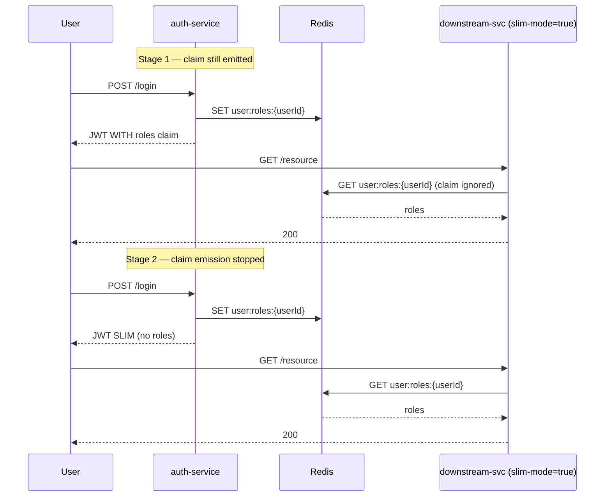

# Phase 02 — Flip Slim-Mode + Drop Roles Claim From Auth-Service

## Context links
- Parent: [plan.md](./plan.md)
- Brainstorm: [/plans/reports/brainstorm-260513-1615-jwt-roles-bloat-revocation.md](../reports/brainstorm-260513-1615-jwt-roles-bloat-revocation.md)
- Depends on: [phase-01](./phase-01-redis-role-store-and-dual-mode-filter.md) (Redis write path + dual-mode filter must be in place; Redis populated for active sessions)

## Overview
- **Date:** 2026-05-13
- **Description:** Flip `namnd.jwt.slim-mode=true` on each downstream service in rolling order (audit → notification → payment → movie → booking — least → most critical). Monitor 401 / Redis P99 between flips. After all 5 stable, drop `roles` claim emission from `JwtService` in auth-service. Wait 7d (`jwtRefreshExpiration` window) for all in-flight fat tokens to expire naturally.
- **Priority:** P1
- **Impl status:** pending
- **Review status:** pending

## Key Insights
1. Phase 01 already populates Redis on login/refresh — Redis is warm before this phase runs.
2. Existing JWTs (with `roles` claim) still work when slim-mode=true because filter ignores claim and reads Redis. As long as user logged in after Phase 01 deployed, Redis has their roles.
3. Users with old tokens issued BEFORE Phase 01 deploy → no Redis entry → empty roles → 403 on protected endpoints. **Mitigation:** wait one full `jwtExpiration` (15min access) after Phase 01 before flipping; OR explicit cache-warmup endpoint.
4. Auth-service keeps emitting `roles` claim until end of this phase — refresh-token flow continues to write Redis, so re-issued tokens always have backing Redis entry.
5. 7d rotation wait = `namnd.app.jwtRefreshExpiration` value (auth-service `application.yml` line ~45).

## Requirements

**Functional**
- Each downstream service `slim-mode=true` via config-map; filter now ignores claim, uses Redis.
- Auth-service `JwtService.generateTokenLogin()` + `generateTokenFromEmail(email, userId, roles)` stop adding `roles` claim. Method signatures unchanged (roles param kept; passed to writer instead).
- New tokens after auth-service flip are slim (no roles claim). Old tokens still work via Redis path.
- Rollback path: flip `slim-mode=false` per service → instant revert (claim path).

**Non-functional**
- 401 rate per service unchanged ±0.5% during flip.
- Redis P99 GET latency < 5ms during sustained load.
- Zero customer-visible disruption.

## Architecture



## Related code files

### Files to MODIFY
- `/Users/admin/Desktop/DEV/BACK_END/ms-cinema/audit-service/src/main/resources/application.yml` — flip `namnd.jwt.slim-mode: true` (Stage 1a).
- `/Users/admin/Desktop/DEV/BACK_END/ms-cinema/notification-service/src/main/resources/application.yml` — same (Stage 1b).
- `/Users/admin/Desktop/DEV/BACK_END/ms-cinema/payment-service/src/main/resources/application.yml` — same (Stage 1c).
- `/Users/admin/Desktop/DEV/BACK_END/ms-cinema/movie-service/src/main/resources/application.yml` — same (Stage 1d).
- `/Users/admin/Desktop/DEV/BACK_END/ms-cinema/booking-service/src/main/resources/application.yml` — same (Stage 1e).
- `/Users/admin/Desktop/DEV/BACK_END/ms-cinema/auth-service/src/main/java/com/namnd/cinema/service/JwtService.java` — remove `.claim("roles", roles)` from `generateTokenLogin` (line 48) and `generateTokenFromEmail` (line 72). Keep param + Redis writer call upstream (Stage 2, after 1+ day soak).
- K8s manifests / config-maps for each service (paths depend on `k8s/` directory layout — verify path during execution).

### Files to CREATE
- None.

### Files to DELETE
- None this phase (claim-reading code in filter still needed for emergency rollback; deleted in Phase 03).

## Implementation Steps

### Stage 1 — Per-service slim-mode flip (rolling, ~1h per service)

1. **Pre-flip checklist (per service):**
   - Confirm `kubectl get cm/<svc>-config -o yaml` shows `slim-mode: false`.
   - Run sample login → assert `redis-cli GET user:roles:{userId}` returns roles.
   - Baseline 401 rate from Grafana / app logs (last 1h).

2. **Flip order (least-blast-radius first):**
   - 1a: audit-service (read-only consumer; minimal user-facing impact)
   - 1b: notification-service
   - 1c: payment-service
   - 1d: movie-service
   - 1e: booking-service (most critical — last)

3. **Per-service flip procedure:**
   - Update `application.yml`: `namnd.jwt.slim-mode: true`.
   - `git commit + push` → CI build.
   - `kubectl rollout restart deployment/<svc>` → wait ready.
   - **Smoke (5 min watch):** 401 rate, Redis P99, error logs. Compare to baseline.
   - **Rollback trigger:** 401 rate +1% or 503 surge → flip `slim-mode: false` → restart.

4. **Soak window:** wait 24h between each service flip in production; 1h in staging.

### Stage 2 — Drop roles claim emission in auth-service (after all 5 services stable on slim-mode=true for ≥48h)

5. **Modify `JwtService.generateTokenLogin`** — remove `.claim("roles", roles)` line:
   ```java
   return Jwts.builder()
       .subject(userPrinciple.getUsername())
       .id(UUID.randomUUID().toString())
       // .claim("roles", roles)  <-- DELETE
       .claim("userId", userPrinciple.getId())
       .issuedAt(new Date())
       .expiration(new Date(System.currentTimeMillis() + EXPIRE_TIME))
       .signWith(getSigningKey())
       .compact();
   ```
   Same in `generateTokenFromEmail(email, userId, roles)` (line 72).

6. **Keep `roles` parameter** in `generateTokenFromEmail` signature — caller still passes it to upstream `rolesWriter.write()` (Phase 1 wiring unchanged). YAGNI: don't refactor signature yet, Phase 3 cleans up.

7. **Deploy auth-service.**
   - Verify new tokens have NO `roles` claim: `echo $JWT | cut -d. -f2 | base64 -d | jq` → no `roles` key.
   - Verify Redis still populated: existing user logs in → `redis-cli GET user:roles:{userId}` returns roles.

### Stage 3 — Rotation wait (7d)

8. **Wait 7 days** = `namnd.app.jwtRefreshExpiration`. All in-flight refresh tokens issued before Stage 2 will have expired; clients forced to re-login → all new tokens are slim.

9. **Verify cutover complete:**
   ```bash
   # Sample 100 recent JWTs from access logs; assert 0 have 'roles' claim
   grep "Authorization: Bearer" /var/log/nginx/access.log | tail -100 | \
     while read t; do
       echo "$t" | awk '{print $NF}' | cut -d. -f2 | base64 -d 2>/dev/null | jq -e .roles >/dev/null 2>&1 && echo "FOUND_FAT"
     done | grep -c FOUND_FAT
   # → 0
   ```

## Todo list
- [ ] Flip audit-service slim-mode + soak 24h
- [ ] Flip notification-service slim-mode + soak 24h
- [ ] Flip payment-service slim-mode + soak 24h
- [ ] Flip movie-service slim-mode + soak 24h
- [ ] Flip booking-service slim-mode + soak 48h
- [ ] Confirm all 5 services stable (no 401/503 spike)
- [ ] Remove `.claim("roles", ...)` from `JwtService.generateTokenLogin` (line 48)
- [ ] Remove `.claim("roles", ...)` from `JwtService.generateTokenFromEmail` (line 72)
- [ ] Deploy auth-service; verify slim JWT shape
- [ ] Wait 7d rotation window
- [ ] Verify access logs show 0 fat JWTs
- [ ] Mark phase complete; proceed to Phase 03 cleanup

## Success Criteria
- All 5 downstream services running with `slim-mode=true` for ≥7 days with no rollback.
- New JWTs (post-Stage 2) contain only `sub`, `userId`, `jti`, `iat`, `exp`.
- Average `Authorization` header size dropped (target: < 500 bytes vs current N×40 bytes/role).
- 401 rate unchanged ±0.5% in steady state.
- Redis P99 GET ≤ 5ms during peak.
- Zero customer-reported auth issues during rolling flip.

## Risk Assessment

| Risk | Mitigation |
|---|---|
| User with old session (issued pre-Phase-01) has no Redis entry → 403 storm after flip | Wait ≥15min (access token TTL) after Phase 01 deploy before first flip; OR add cache-warmup endpoint that backfills from DB on miss (deferred — YAGNI) |
| Redis outage during/after flip → all downstream services 503 | Pre-flip: confirm Redis HA / monitoring; rollback flag flip < 5min via config-map |
| Auth-service flip (Stage 2) races with ongoing refresh-token rotation → some clients hold stale fat tokens | Filter ignores claim anyway when slim-mode=true; harmless |
| Forgot to flip one service → still reading claim → slow propagation of revocations | Phase 03 deletion of claim path is the hard guard; until then, every service must be in flip checklist |
| K8s config-map change not picked up without pod restart | Always pair config-map edit with `kubectl rollout restart`; document in runbook |

## Security Considerations
- **Window of mixed mode:** during Stage 1, some services use Redis, some use claim. Same user could see different role lists across services if Redis stale and claim newer. Mitigation: Phase 01 writes Redis BEFORE responding to login → Redis always at least as fresh as claim.
- **Logout enforcement gap:** During Stage 1 a service still on claim won't honor `DEL user:roles:{userId}` from logout. Existing token blacklist (`BlacklistedTokenServiceImpl`) covers this. Once all flipped, Redis-DEL is the source of truth.
- **Audit:** Stage 1 flip + Stage 2 commit go through standard PR review.

## Next steps
Phase 03 — delete `slim-mode` property, delete legacy claim-reading code from filter and validator, simplify `JwtService` signatures.
