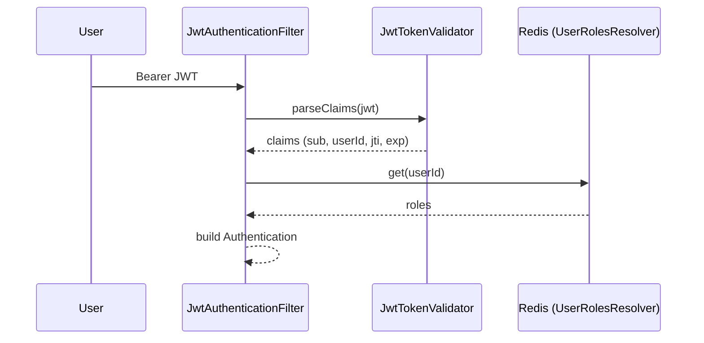

# Phase 03 — Cleanup Legacy Claim Paths + Slim-Mode Flag

## Context links
- Parent: [plan.md](./plan.md)
- Depends on: [phase-02](./phase-02-flip-slim-mode-and-drop-claim.md) (all services flipped + 7d rotation window elapsed; new tokens confirmed slim)

## Overview
- **Date:** 2026-05-13
- **Description:** Remove `slim-mode` property + dual-mode branch from `JwtAuthenticationFilter`. Delete legacy claim-reading helper `JwtTokenValidator.getRoles()` (no callers after this PR). Simplify `JwtService.generateTokenFromEmail` overload — drop unused `roles` param. Final cleanup; no behavior change.
- **Priority:** P2 (technical-debt removal, not blocking)
- **Impl status:** pending
- **Review status:** pending

## Key Insights
1. Phase 02 verified 0 fat JWTs in production logs after 7d rotation window — safe to delete claim path.
2. Once slim-mode branch removed, `UserRolesResolver` becomes mandatory (no opt-out). Conditional bean stays for non-auth modules but autoconfigure can drop `@ConditionalOnProperty`.
3. `generateTokenFromEmail(email, userId, roles)` legacy overload still passes `roles` to caller-side Redis writer — but writer can fetch roles from DB or be invoked separately. Keep param OR refactor caller chain in this phase (recommend: simplify here, single source of truth).

## Requirements

**Functional**
- `JwtAuthenticationFilter` reads roles ONLY from `UserRolesResolver` — no `slimMode` branch.
- `JwtAuthProperties.slimMode` property deleted.
- `JwtTokenValidator.getRoles(Claims)` method deleted (no callers).
- `JwtService.generateTokenLogin` + `generateTokenFromEmail` no longer accept `roles` param in any new signature.
- Documentation (`docs/system-architecture.md`, `docs/code-standards.md`) reflects new flow.

**Non-functional**
- All 7 modules compile + tests pass.
- No behavior change at runtime (this is pure code cleanup).

## Architecture

Identical to end-state of Phase 02. Diagram simplified — no `alt` branch in filter:



## Related code files

### Files to MODIFY
- `/Users/admin/Desktop/DEV/BACK_END/ms-cinema/jwt-auth-autoconfigure/src/main/java/com/namnd/jwt/autoconfigure/JwtAuthProperties.java` — delete `slimMode` field + accessors.
- `/Users/admin/Desktop/DEV/BACK_END/ms-cinema/jwt-auth-autoconfigure/src/main/java/com/namnd/jwt/autoconfigure/JwtAuthenticationFilter.java` — delete the `if (props.isSlimMode())` branch; always use `UserRolesResolver`. If resolver missing → 503 (config error).
- `/Users/admin/Desktop/DEV/BACK_END/ms-cinema/jwt-auth-autoconfigure/src/main/java/com/namnd/jwt/autoconfigure/JwtTokenValidator.java` — delete `getRoles(Claims)` method (lines 55-59).
- `/Users/admin/Desktop/DEV/BACK_END/ms-cinema/jwt-auth-autoconfigure/src/main/java/com/namnd/jwt/autoconfigure/roles/UserRolesResolverAutoConfiguration.java` — drop `@ConditionalOnProperty("namnd.jwt.slim-mode")` (now unconditional when Redis on classpath).
- `/Users/admin/Desktop/DEV/BACK_END/ms-cinema/auth-service/src/main/java/com/namnd/cinema/service/JwtService.java` — refactor `generateTokenFromEmail(email, userId, roles)` → `generateTokenFromEmail(email, userId)`; remove unused `roles` param + `getRolesFromToken` method (line 128-136) if no callers remain.
- `/Users/admin/Desktop/DEV/BACK_END/ms-cinema/auth-service/src/main/java/com/namnd/cinema/controller/AuthController.java` — update call sites of `generateTokenFromEmail` to drop `roleNames` arg (Redis writer still called separately).
- All 5 downstream `application.yml` — remove `namnd.jwt.slim-mode: true` line (property no longer exists).
- `/Users/admin/Desktop/DEV/BACK_END/ms-cinema/auth-service/src/main/resources/application.yml` — verify no `slim-mode` references remain.
- `/Users/admin/Desktop/DEV/BACK_END/ms-cinema/docs/system-architecture.md` — update auth section: JWT is slim, roles live in Redis.
- `/Users/admin/Desktop/DEV/BACK_END/ms-cinema/docs/project-changelog.md` — add changelog entry.

### Files to DELETE
- None — all changes are in-file edits.

### Files to CREATE
- None.

## Implementation Steps

1. **Delete `slimMode` from `JwtAuthProperties`** — remove field + getter/setter. Update any javadoc.

2. **Simplify `JwtAuthenticationFilter`**:
   ```java
   // Before
   List<String> roles;
   if (props.isSlimMode()) { roles = resolver.get(userId); ... }
   else { roles = tokenValidator.getRoles(claims); }

   // After
   List<String> roles;
   UserRolesResolver resolver = resolverProvider.getIfAvailable();
   if (resolver == null) {
     log.error("UserRolesResolver missing — Redis/auth misconfigured");
     res.sendError(503, "Auth not configured");
     return;
   }
   try {
     roles = new ArrayList<>(resolver.get(userId));
   } catch (RedisConnectionFailureException e) {
     rateLimitedLogger.warn("Redis unavailable: {}", e.getMessage());
     res.setHeader("Retry-After", "5");
     res.sendError(503, "Auth cache unavailable");
     return;
   }
   ```

3. **Delete `JwtTokenValidator.getRoles(Claims)`** (lines 55-59).

4. **Drop `@ConditionalOnProperty` from `UserRolesResolverAutoConfiguration`** — keep `@ConditionalOnClass(RedisTemplate.class)` only.

5. **Refactor `JwtService`**:
   - Remove `generateTokenFromEmail(String email, Long userId, List<String> roles)` overload (lines 68-78). Keep simpler `generateTokenFromEmail(String email, Long userId)`.
   - Update `generateTokenLogin` — already roles-free after Phase 02; verify.
   - Delete `getRolesFromToken(String token)` if no callers (grep first).

6. **Update `AuthController` call sites** — replace `generateTokenFromEmail(email, userId, roleNames)` with `generateTokenFromEmail(email, userId)`. `roleNames` still passed to `rolesWriter.write(userId, roleNames)` — unchanged.

7. **Remove `slim-mode: true` lines** from all 5 downstream `application.yml`.

8. **Compile + run all tests:**
   ```bash
   mvn clean test -pl jwt-auth-autoconfigure,auth-service,booking-service,movie-service,payment-service,notification-service,audit-service
   ```

9. **Update docs:**
   - `docs/system-architecture.md` — auth diagram + JWT shape section.
   - `docs/project-changelog.md` — entry: "JWT slim-mode cutover complete; legacy claim-reading paths removed."

10. **E2E smoke** — login → assert JWT shape (no `roles` claim, no `slim-mode` config); call protected endpoint → 200.

11. **Final verification:**
    ```bash
    # Confirm no stale references
    grep -rn "slim-mode\|slimMode\|getRoles(Claims" --include="*.java" --include="*.yml" .
    # → 0 results
    ```

## Todo list
- [ ] Delete `slimMode` field + accessors from `JwtAuthProperties`
- [ ] Simplify `JwtAuthenticationFilter` — single Redis path, drop `if (slimMode)` branch
- [ ] Delete `JwtTokenValidator.getRoles(Claims)` method
- [ ] Drop `@ConditionalOnProperty` from `UserRolesResolverAutoConfiguration`
- [ ] Delete `JwtService.generateTokenFromEmail(email, userId, roles)` overload
- [ ] Delete `JwtService.getRolesFromToken(token)` if unused (verify via grep)
- [ ] Update `AuthController` call sites
- [ ] Remove `slim-mode` line from all 5 downstream application.yml
- [ ] Run `mvn clean test` across all 7 modules — all green
- [ ] Update `docs/system-architecture.md`
- [ ] Add `docs/project-changelog.md` entry
- [ ] E2E smoke test
- [ ] grep confirms zero `slim-mode` / `getRoles(Claims` references

## Success Criteria
- All 7 modules compile + all unit/integration tests pass.
- Zero `slim-mode`, `slimMode`, `getRoles(Claims` references in source tree (grep verification).
- Filter LOC reduced (dual-mode branch ~20 lines removed).
- Docs reflect new architecture.
- E2E smoke: login + protected endpoint call returns 200.
- No customer-visible change (this is pure cleanup).

## Risk Assessment

| Risk | Mitigation |
|---|---|
| Hidden caller of deleted `getRoles(Claims)` outside this repo | grep across all sibling repos before deletion; safe within ms-cinema mono-repo |
| Removing `@ConditionalOnProperty` forces Redis on consumers who didn't enable slim-mode | All 5 services + auth-service already have Redis after Phase 01; check no NEW consumer added jwt-auth-autoconfigure without Redis |
| Test that mocks `JwtAuthProperties.slimMode` breaks | Update test fixtures; trivial |
| Docs out of sync after merge | Make docs update part of same PR |

## Security Considerations
- No new attack surface. Hardening — removing the conditional branch ensures all services use Redis-backed RBAC (no accidental claim-trust fallback if config drift re-enabled slim-mode=false in error).
- Final state: JWT is opaque-ish (signed identity token), all authorization decisions resolved server-side via Redis. Compromised JWT cannot grant elevated roles by tampering with claim list (claim ignored).

## Next steps
- Phase complete → close plan, mark status=done in `plan.md`.
- Post-merge: monitor production 401 rate + Redis P99 for 7d.
- Defer: Caffeine L1 cache + Kafka invalidation reintroduction if load tests later show Redis hot (track as separate plan).
