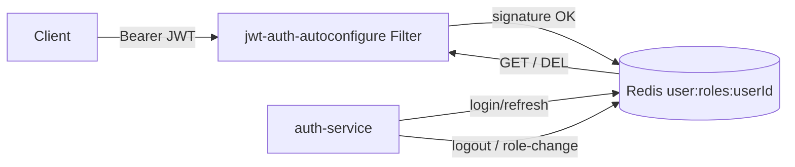

## Problem
JWT `roles` claim balloons with RBAC growth (nginx 8KB header risk) AND revocation impossible until token expiry. See [brainstorm report](../reports/brainstorm-260513-1615-jwt-roles-bloat-revocation.md) — Approach C selected, then simplified after honest scale review.

## Solution
Slim JWT (`sub`, `userId`, `jti`, `iat`, `exp`) → roles in Redis `user:roles:{userId}` → downstream filter reads Redis per request. Logout / role-change = `DEL` key → next request sees fresh state instantly.

**Why no Caffeine?** Cinema-scale traffic (~10-100 req/s realistic) doesn't stress Redis. 0.5ms LAN hop per request is negligible. YAGNI.

**Why no Kafka?** Without local cache there's nothing to invalidate. Redis is single source of truth. Saves an entire moving part.

Caffeine + Kafka deferred — add only if load tests later show Redis hot or QPS budget breached.

## Architecture

Sequence:
1. Login → auth-service writes Redis `SET user:roles:{userId}` TTL=jwtRefreshExp+5min
2. Request → downstream filter verifies JWT → GET Redis → build authorities
3. Logout / role-change → auth-service DELs (or overwrites) Redis key
4. Next request hits empty / new value → effect is instant

## Phases

| # | Title | Status | Est. | File |
|---|---|---|---|---|
| 1 | Redis role store + dual-mode filter (slim-mode flag off) | pending | 1.5d | [phase-01](./phase-01-redis-role-store-and-dual-mode-filter.md) |
| 2 | Flip slim-mode + drop roles claim from auth-service | pending | 0.5d + 7d rotation wait | [phase-02](./phase-02-flip-slim-mode-and-drop-claim.md) |
| 3 | Cleanup legacy paths | pending | 0.5d | [phase-03](./phase-03-cleanup-legacy-claim-paths-and-flag.md) |

## Research
- [Researcher-01: Codebase inventory](./research/researcher-01-codebase-inventory.md)
- [Researcher-02: Tech patterns](./research/researcher-02-tech-patterns.md) — Caffeine/Kafka sections now informational (deferred)
- [Brainstorm: Approach C rationale](../reports/brainstorm-260513-1615-jwt-roles-bloat-revocation.md)

## Migration runbook
1. Deploy Phase 1 — additive, slim-mode=false everywhere. Verify Redis writes on login.
2. Phase 2a — flip `namnd.jwt.slim-mode=true` per service via config-map, one at a time. Monitor 401 + Redis P99.
3. Phase 2b — once all stable, stop emitting `roles` claim in auth-service. Wait 7d for refresh-token rotation window.
4. Phase 3 — delete legacy code + property flag.

## Validation Summary

**Validated:** 2026-05-13
**Decisions confirmed:**
- Tenant scope: user-global. Redis key = `user:roles:{userId}`.
- Redis outage: fail-closed 503 + `Retry-After: 5`.
- Admin endpoint: new `AdminRoleController` in auth-service, `@PreAuthorize("hasRole('ADMIN')")`.
- Post-validation: dropped Caffeine + Kafka after honest review of traffic scale.

## Unresolved questions
- Load-test threshold at which Caffeine becomes worth adding (defer until evidence).
- Redis HA story — current single-node is SPOF for auth. Mitigation: monitor + sentinel/cluster when scale justifies.
